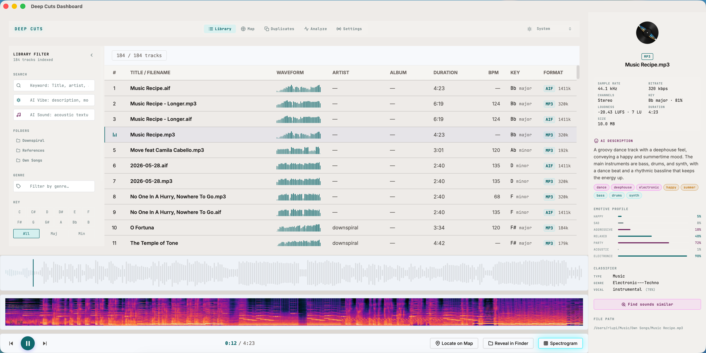
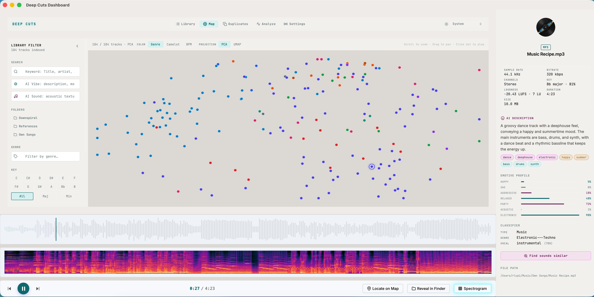

# Deep Cuts (com.rlupi.deep-cuts)

Deep Cuts is an offline-first studio audio analysis application and reference library. It cuts through thousands of tracks in your local collection to reveal their underlying musical and sonic structure using local digital signal processing (DSP) and offline machine-learning indexing.

100% offline, private, and designed to run sandboxed on macOS.

📺 **[Watch the Deep Cuts Showcase Video on YouTube](https://youtu.be/MZGEO9H4_EA)**

---

## Screenshots





---

## ✨ Features

### Library Management

- **Library Indexing**: Recursively scans watched directories for audio files (MP3, FLAC, WAV, AIFF, M4A, and more). Reads embedded metadata tags (title, artist, album, BPM, key, year, lyrics, etc.) via `lofty`. Gracefully re-indexes changed files and skips unreadable ones.
- **Sidecar Persistence** (`.dc.json`): Optionally writes a JSON sidecar file next to each audio file containing all computed analysis results (opt-in, disabled by default). Sidecars are restored automatically on re-index, so analysis work survives library moves and re-imports. The Export Sidecars command bulk-writes all tracks at once.
- **AcoustID Metadata Enrichment**: Fingerprints tracks against the AcoustID/MusicBrainz database to fill in missing title, artist, album, and year metadata. Cover art is fetched and cached locally in the database.
- **Reveal in Finder / Explorer**: Opens the system file manager with the track's file selected. macOS, Windows, and Linux are all handled.

### Audio Analysis Pipeline

A concurrent, spool-based analysis engine that processes the library in parallel using `num_cpus / 2` worker threads. Passes run in dependency order:

- **BPM** — spectral-flux onset envelope with autocorrelation and parabolic sub-sample refinement (40–210 BPM range, 80–160 BPM preference).
- **BPM Correction** — coarse metadata genre used to resolve half/double-time errors.
- **BPM Refinement** — precise Discogs-400 genre label used for a second correction sweep.
- **Key & Scale** — chromagram built via FFT, HPCP-style harmonic suppression, and Krumhansl-Schmuckler profile correlation.
- **Loudness** — integrated loudness (LUFS) and loudness range (LRA) via EBU R128 using `ebur128`.
- **Waveform** — 128-point RMS energy profile for fast visual rendering.
- **Duration** — derived from container metadata with a sample-count fallback.
- **Essentia Classifier** — Discogs-Effnet ONNX model for hierarchical genre (400 classes), vocal/instrumental detection with confidence, and seven mood axes (happy, sad, aggressive, relaxed, party, acoustic, electronic). Runs a producer–consumer pipeline: multiple decode/spectrogram workers feed a single ONNX inference consumer.
- **CLAP Audio Embeddings** — LAION CLAP ONNX model producing 512-dimensional audio embeddings from 10-second windows, stored in a `sqlite-vec` virtual table for fast KNN search.
- **Qwen2-Audio Description** — local Qwen2-Audio-7B-Instruct GGML model (served via `llama-server`) produces a freeform text description, AI genre tag, and mood label per track.
- **Description Embeddings** — all-MiniLM-L6-v2 ONNX model encodes the Qwen-generated description for semantic text search.

### Search & Filtering

Real-time filtering in the sidebar with zero round-trips to the backend:

- **Full-text search** across title, artist, album, and filename.
- **Genre** — autocomplete from all distinct metadata and Essentia-detected genres.
- **Folder** — multi-select from watched directories; shows only when multiple roots are configured.
- **Key** — multi-select note grid (C, C#, D … B) with All / Major / Minor scale toggle.
- **BPM Range** — dual-handle range slider with quick presets (Slow / Mid / Fast / V.Fast / All).
- **Vocals** — All / Vocals / Instrumental toggle, driven by Essentia `detected_vocal`.
- **Music Only** — hides tracks Essentia classified as `Non-Music` (audiobooks, spoken word, etc.).
- **Sounds Similar** — CLAP-based K-Nearest Neighbors filter launched from the track detail pane; surfaces the most acoustically similar tracks across the entire library.
- **Mood** — seven dual-handle histogram sliders (happy, sad, aggressive, relaxed, party, acoustic, electronic) driven by Essentia mood scores.
- Active filters shown as removable chips with a single "Clear all" action.

### The Music Map

- **UMAP Projection**: 2D visual projection of the entire audio collection using CLAP embeddings and Rust-native UMAP dimensionality reduction, rendered on a full-size canvas element.
- **D3 zoom / pan** with smooth transitions.
- **Filter-aware**: the projected points reflect the current sidebar filter state.
- **Floating toolbar** for projection controls.
- **Hover tooltips** showing track metadata.
- **Dynamic top-10 genre scanning** that updates the legend as you pan.
- **KNN Inspection pane**: click any point to find its nearest neighbours, with native audio playback and progress scrubbing.

### Audio Player

- WaveSurfer.js waveform and spectrogram visualisation.
- Play / pause / prev / next controls in a persistent `PlayerBar`.
- Track detail pane showing technical specs (sample rate, bit depth, channels, bitrate), key, loudness, BPM, lyrics, comments, AI description, mood, and instruments.
- **Mood Radar**: Spider chart showing the full Essentia mood profile (seven axes) for the selected track.
- **Reset Analysis Pass**: Per-track menu to clear and re-run any individual analysis pass without re-scanning the whole library.
- "Sounds Similar" button that fires a CLAP KNN query and activates the similarity filter.

### Local Multimodal AI Chat

- **Interactive Track Chat**: Dedicated Chat tab in the Track Detail Pane allowing producers to converse directly with their audio files. Ask questions like: *"Why does this sound muddy?"*, *"What's the structure/arrangement?"*, or *"Describe the vocal placement."*
- **Multimodal Context**: Powered by local `llama-server` and `Qwen2-Audio-7B-Instruct`. The first turn uploads the raw audio waveform, and subsequent turns support context-aware text-only conversation.
- **WaveSurfer Region Selector**: Select and slice specific segments of the track (e.g. intro, drop, bridge) using an interactive WaveSurfer region handler to target analysis on long files without blowing LLM context windows.
- **Real-Time Token Streaming**: Supports full Server-Sent Events (SSE) streaming for instantaneous token generation and snappy user feedback.
- **Persistent Chat Sessions**: Conversations are saved to the database with full-text search and a session picker, so you can return to previous Q&A sessions for any track.

### Playlists

- Save and load named playlists directly from the sidebar.
- Export any playlist or the current filtered set as a native M3U file via the macOS save dialog.

### Statistics

- Dedicated Statistics page comparing audio feature distributions (BPM, key, loudness, genre, mood) between the full library and the current filter.
- Scope selector to compare the full library, the active filter, or a specific folder.

### UI & Theming

- **Sonic Glitch design system**: `--sg-*` CSS custom property tokens used throughout.
- **Dark Mode**: cyber-cyan, studio-pink, and deep-indigo glow interface.
- **Light Mode**: clean, professional bright slate/indigo studio theme.
- **Accessible Mode**: high-contrast black-and-white theme with stark borders and zero panel blurs.
- **Global Toast notifications** for background events (scan complete, export results, etc.).
- Collapsed/expandable filter sidebar with an active-filter indicator dot.

### Architecture & Quality

- **Decoupled & Testable**: self-contained Rust backend with fully modular Tauri command modules, database models using the Repository CRUD pattern, separate services (`PipelineManager` and `LibraryScanner`), custom serializable `AppError` handling, and an RAII `SleepPreventer` guard.
- **Rust unit & integration tests** covering DSP algorithms, database transactions, UMAP coordinates, and schema migrations.
- **Svelte 5 frontend tests** (Vitest) covering filter store, player store, UI store, and theme store.
- **Performance**: single-source-of-truth `LibraryStore` global cache; on-demand DOM pagination capped at 150 rendered rows ensures instant search, scroll, and filter at library scales of thousands of tracks.

---

## 🛠️ Technology Stack

- **Frontend**: Svelte 5, static SvelteKit (SPA mode), Vite, vanilla CSS, D3.js, WaveSurfer.js.
- **Backend**: Tauri v2 (Rust).
- **Storage & Vector Search**: SQLite (`rusqlite`) and `sqlite-vec` for local vector embeddings.
- **Audio DSP & Tagging**: `lofty` and `symphonia` for audio decoding and tag parsing; `ebur128` for loudness.
- **Machine Learning**: `ort` (ONNX Runtime) for local, private model inference; `llama-server` for Qwen2-Audio.

---

## 🚀 Development & Build

### Prerequisites

| Requirement | Version | Notes |
|---|---|---|
| [Rust](https://rustup.rs/) | ≥ 1.77.2 | Install via `rustup` |
| [Node.js](https://nodejs.org/) | ≥ 18 | LTS recommended |
| [Python](https://www.python.org/) | ≥ 3.10 | Required to export ONNX models |
| [llama.cpp](https://github.com/ggerganov/llama.cpp) | latest | Bundled as an in-app sidecar (can be staged via `tools/.venv/bin/python tools/download_llama_server.py`) |

On macOS and Linux, the application automatically bundles and resolves a local `llama-server` sidecar, meaning external installation via Homebrew is optional.

### Setting Up Models

The easiest way to set up models is to use the **in-app Model Downloader**:
1. Launch Deep Cuts.
2. Open the **Settings** panel (gear icon).
3. Under **Model Folder**, click **Choose Folder** to select a custom models directory (or leave default to use your sandboxed Application Data directory).
4. Click **Manage Models** to open the interactive downloader. You can download, verify, and monitor the progress of all required neural networks (CLAP, MiniLM, Essentia classifiers, and Qwen2-Audio GGUF checkpoints) directly inside the app.

Alternatively, for offline setup or development, you can use the command-line tools:

```bash
# Run from the repository root.

# 1. Download and stage the llama-server sidecar binary and dynamic libraries:
tools/.venv/bin/python tools/download_llama_server.py

# 2. Generate CLAP and sentence encoder models (~700 MB total)
tools/.venv/bin/python tools/export_clap_onnx.py
tools/.venv/bin/python tools/export_sentence_onnx.py
```

Then download the Essentia classifier models from the [Essentia model hub](https://essentia.upf.edu/models/) and Qwen2-Audio GGUF weights (`Qwen2-Audio-7B-Instruct.Q4_K_M.gguf` & `Qwen2-Audio-7B-Instruct.mmproj-Q8_0.gguf`) and place them in your configured models directory. See [models/README.md](models/README.md) for full offline instructions.

### Installing Dependencies

```bash
npm install
```

### Running in Development

```bash
npm run tauri dev
```

### Running Tests

```bash
# Rust backend tests
cargo test --manifest-path src-tauri/Cargo.toml

# Frontend tests
npm test
```

### Building for Production

```bash
npm run tauri build
```

---

## 📦 Binary Releases

The first binary release is now officially online!

Download the pre-compiled installer for Apple Silicon Macs from the [GitHub Releases Page](https://github.com/robertolupi/deep-cuts/releases).

Deep Cuts features a zero-dependency local distribution model out-of-the-box:

- **Bundled llama-server runtime**: Dynamically resolved and managed sidecar, complete with relocation-safe shared libraries.
- **In-app model download and verification**: Full, resumed-ready downloads via Svelte/Rust IPC.
- **Selectable analysis profiles**: Configurable pipeline passes for customized library scanning speed.
- **Graceful degradation**: The core DSP analysis (BPM, key, loudness, waveforms) remains fully operational even if optional AI/LLM models are not downloaded.

---

## ⚖️ Licensing

Deep Cuts is open-source software licensed under the **GNU Affero General Public License v3.0 (AGPLv3)**. See [LICENSE.md](LICENSE.md) for details.

### License note

Some DSP/MIR implementation work was informed by studying [Essentia](https://essentia.upf.edu/), which is also licensed under AGPLv3. To keep licensing simple and conservative, the application is distributed under AGPLv3.

### Model licenses

The app code is AGPLv3, but the optional model files it uses have their own licenses. A full "all features enabled" setup includes assets that are **not commercially usable** without reviewing upstream terms:

| Model | License | Notes |
|---|---|---|
| LAION CLAP | Apache 2.0 | Free for commercial use |
| all-MiniLM-L6-v2 | Apache 2.0 | Free for commercial use |
| Essentia Discogs-Effnet (genre) | [CC BY-NC-ND 4.0](https://creativecommons.org/licenses/by-nc-nd/4.0/) | Not commercially distributable |
| Essentia mood/vocal classifiers | [CC BY-NC-ND 4.0](https://creativecommons.org/licenses/by-nc-nd/4.0/) | Not commercially distributable |
| Qwen2-Audio-7B-Instruct | [Qwen License](https://huggingface.co/Qwen/Qwen2-Audio-7B-Instruct) | Check upstream terms |

**Developers building commercial products or services** that bundle or redistribute these models should review their licenses. Using Deep Cuts as a tool in a professional workflow — including for commercial music production — is fine. The app remains fully functional for BPM, key, loudness, waveform, and CLAP similarity search using only Apache 2.0 models.
