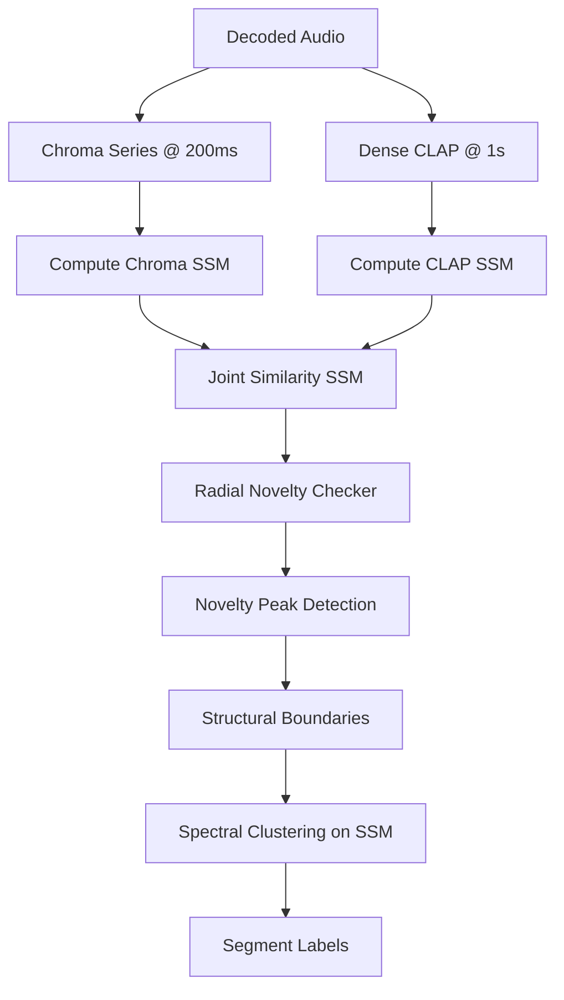

# Scoping Note: Dense-Embedding SSM & Novelty-Based Boundary Tagger

To break past the rigid quantization limit of the 16-bin grid, we propose a prototype system using dense audio embeddings (chroma and/or CLAP) to construct a **Self-Similarity Matrix (SSM)** and derive structural boundaries via **radial novelty filtering**.

---

## 1. Core Architecture

### A. Feature Extraction (Resolution = 200ms–1s)
* **Chroma**: Sample chroma vectors at a hop size of ~200ms to capture harmonic shifts and chord changes.
* **Dense CLAP**: Compute CLAP audio embeddings over sliding 2-second windows with a 1-second step (current CLAP only has 3 windows per track, which is too sparse).

### B. Self-Similarity Matrix (SSM) Computation
* Construct a cosine distance matrix $S$ where $S[i, j]$ is the similarity between frame $i$ and frame $j$.
* Combine chroma SSM and CLAP SSM to represent both harmonic transitions and acoustic texture changes.

### C. Novelty Checker (Radial Filtering)
* Slide a **Gaussian checkerboard kernel** $K$ (e.g., $L \times L$ matrix, where $L$ is a window size like 10 seconds) along the main diagonal of $S$.
* The novelty score at frame $i$ is the correlation between the kernel $K$ and the sub-matrix centered on $S[i, i]$.
* Local maxima (peaks) in this novelty curve indicate structural transitions (boundaries).

### D. Label Assignment via Clustering
* Group the resulting segments into functional classes (verse, chorus, etc.) using **Spectral Clustering** or **K-Means** on the SSM eigenvectors, avoiding predefined templates.

---

## 2. Experimental Plan

1. **DSP Scoping (Validation set)**:
   * Recompute dense chroma time-series and dense CLAP embeddings.
   * Tune kernel width $L$ and peak prominence thresholds to maximize Boundary F1 at ±0.5s.
2. **Baseline Comparison**:
   * Compare results head-to-head against the 16-bin grid ceiling (**29.36%**) and the baseline (**18.04%**). We expect to break the ceiling at ±0.5s.
3. **Persist Strategy**:
   * Once validated, integrate the feature cache into the Tauri sidecar structure.
