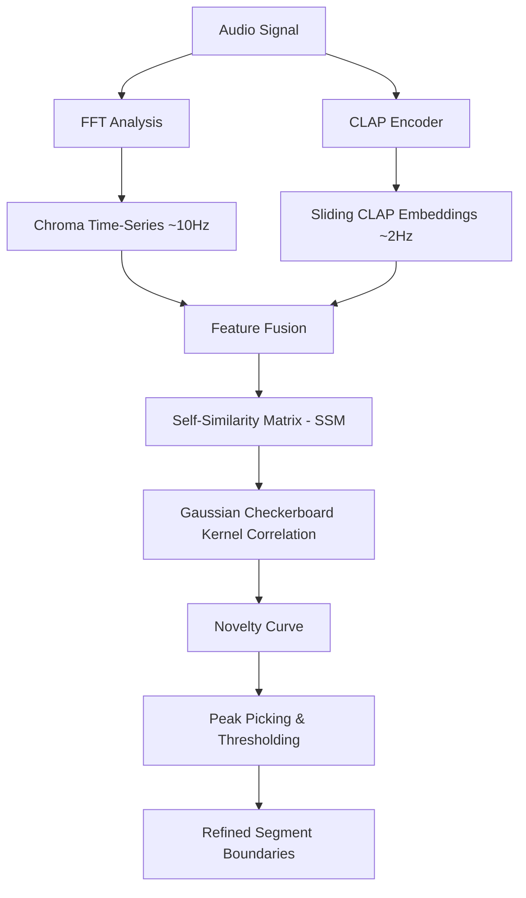

# Scoping Blueprint: Dense-Embedding Self-Similarity Novelty Boundary Detector

> **Status: FROZEN (2026-06-07).** Gemini and Claude agreed on this blueprint (storage
> strategy + chroma-first sequencing). Next step is the Phase-1 Python prototype — but per the
> app-first priority this is a parked/opportunistic research track, not active app work.

This document outlines the scoping design for upgrading the structural boundary and segment labeling pipeline in Deep Cuts. By leveraging continuous dense embeddings (chroma and sliding CLAP) and self-similarity matrices (SSM), this prototype aims to resolve the 16-bin quantization bottleneck and place boundaries with sub-second resolution.

> **Claude review (2026-06-07):** algorithm (§1–2) endorsed. Revised §3 (storage — the
> original plan to persist raw N×N SSMs in SQLite is a bloat trap), §4 (canonical mir_eval
> numbers + a holdout-reuse caution), and §5 (target framing against the real ~34% oracle).
> Goal is a usable app, not a SoTA paper — the SoTA-claim language was removed.

---

## 1. Algorithmic Architecture

The core approach adopts the Foote self-similarity novelty method, augmented by multi-modal feature representations (harmony + timbre).



### Self-Similarity Matrix (SSM) Calculation
Given a fused embedding time-series $X = [x_1, x_2, \dots, x_N]$, the cosine distance self-similarity matrix $S \in \mathbb{R}^{N \times N}$ is computed as:
$$S(i, j) = \frac{x_i \cdot x_j}{\|x_i\| \|x_j\|}$$

### Novelty Function & Checkerboard Kernel
A radial Gaussian checkerboard kernel $K_L$ of size $L \times L$ is slid along the diagonal of $S$ to calculate the novelty score $N(t)$:
$$N(t) = \sum_{a=-L/2}^{L/2} \sum_{b=-L/2}^{L/2} S(t+a, t+b) \cdot K_L(a, b)$$
Where $K_L$ is defined with a sign change across quadrants to act as a localized transition detector.

---

## 2. Upstream DSP Pipeline Changes

To support the prototype, the Rust/Tauri backend's DSP pipeline (`src-tauri/src/dsp.rs`) must be refactored to emit continuous time-series rather than downsampled statistics:

1. **Chroma Series Output**:
   - Currently, chroma is accumulated into a single 12-dimensional vector per 10-second block to perform key classification.
   - **Change**: Emit the frame-level chroma vectors (e.g., hopped at 100-200ms windows) to capture harmonic progression over time.

2. **Sliding CLAP Embeddings**:
   - Currently, CLAP embeddings are computed for large static blocks or single tracks.
   - **Change**: Implement a sliding-window CLAP encoder that extracts a 512-dimensional embedding every 500ms (window size 2.0s to 5.0s) to capture sliding timbral/textural context.

3. **Onset Strength Envelope**:
   - Cache and export the high-resolution onset envelope (computed at ~23ms frames via spectral flux) to enable sub-second peak snapping.

---

## 3. Storage Strategy (`database.rs` + sidecars)

**Do not persist the SSM.** The original plan to store raw $N \times N$ matrices in SQLite
is a bloat trap: a 4-minute track at the proposed ~10 Hz chroma rate is $N \approx 2400$, so
$S$ is ~5.8M floats ≈ **23 MB per track as f32** — hundreds of tracks would add many GB to
the production database for data that is *cheap to recompute on demand* from the cached
features. The SSM is an intermediate, not an artifact. Recompute it in the eval script (and,
later, on the fly in Rust) from the stored time-series.

Follow the **hybrid** already agreed for feature (B) — compact summaries in the DB, fat
time-series in the sidecar:

* **DB column (`tracks`), compact, app-facing:** the *output* only — a small JSON list of
  detected boundaries with novelty scores. This is what the UI and retrieval consume.
  ```sql
  ALTER TABLE tracks ADD COLUMN boundary_candidates TEXT; -- JSON: [{"time": 12.34, "novelty": 0.89}, ...]
  ```
  (Reuse / supersede feature A's `sax_alignment_boundaries` rather than adding a parallel
  column — decide before implementing.)

* **`.dc.json` sidecar, fat, eval-facing:** the dense inputs — frame-level chroma series,
  the ~23 ms onset-strength envelope, and the sliding-CLAP embeddings. These already have a
  home in the sidecar from feature (B); extend it, don't move it into the DB.

* **Offline eval store (optional):** if the Python SSM sweep wants matrices cached for speed,
  use a **separate, throwaway eval database or `.npy` files on disk** — never the production
  `deep_cuts.db`.

---

## 4. Evaluation Protocol

We will measure performance against the SALAMI dataset using the validation splits, all under
`mir_eval.segment.detection` (bipartite matching). Canonical reference numbers, dual-annotator
subset (N=196), so this prototype is judged against the same anchors:

| mir_eval F1 | Baseline (16-bin) | Refined (`augment+8peaks_5s`) | Grid ceiling / oracle | Human ceiling |
|---|---|---|---|---|
| **±3.0s** | 21.8% | 33.3% | ~34% | **71.5%** |
| **±0.5s** | 3.8% | 7.6% | ~6.6% | **64.6%** |

* **The bar to clear is the ~34% oracle, not the refined 33%.** Post-processing the 16-bin
  grid already saturates it. To beat ~34% the SSM detector must place *genuinely off-grid*
  boundaries (which it can, being continuous) — anything ≤34% means it hasn't actually
  escaped the grid.
* **The real headroom is at ±0.5s.** Baseline is 3.8% vs a 64.6% human ceiling there; the
  whole point of sub-second resolution is to move ±0.5s dramatically, not just nudge ±3s.
* **Leakage / holdout discipline (important):** tune kernel width $L$, fusion weights, and
  peak threshold $\theta$ on validation only. **The 57-track holdout has already been spent
  once** confirming `augment+8peaks_5s` — this is a *new approach* with new hyperparameters,
  so it gets exactly **one** fresh holdout pass after the config is frozen. If several SSM
  variants need a held-out number, carve a fresh slice; do not re-score the spent holdout
  repeatedly (`how-to-experiment` test-set rules).

---

## 5. Implementation Milestones

1. **Phase 1: Python Prototype (Offline Sandbox)** — *gate before any Rust work.*
   - Extract raw chroma and CLAP time-series using python scripts (chroma is the cheap win;
     dense CLAP is a large recompute — current pipeline has only 3 CLAP windows/track, so
     prototype with chroma-only first and add CLAP only if chroma alone underperforms).
   - Implement the SSM and checkerboard kernel peak picker.
   - **Gate:** beat the ~34% oracle at ±3s *and* show a meaningful jump at ±0.5s (target the
     teens or better vs the 3.8% baseline) on validation. If it can't clear the oracle, the
     SSM isn't escaping the grid and Phase 2 is not worth the cost.

2. **Phase 2: Rust DSP & Database Integration** *(only if Phase 1 clears the gate)*
   - Port SSM calculation and kernel correlation to Rust using `ndarray`.
   - Persist per §3 (compact boundaries in DB, dense features in sidecar — no SSMs in the DB).

3. **Phase 3: Svelte Frontend Visualizer**
   - Render the self-similarity matrix as an interactive D3.js heatmap in the UI.
   - Display the novelty curve alongside the waveform for visual structure inspection.
