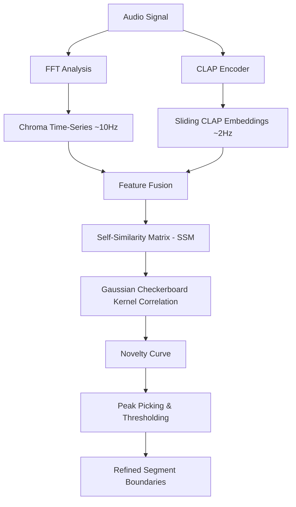

# Scoping Blueprint: Dense-Embedding Self-Similarity Novelty Boundary Detector

This document outlines the scoping design for upgrading the structural boundary and segment labeling pipeline in Deep Cuts. By leveraging continuous dense embeddings (chroma and sliding CLAP) and self-similarity matrices (SSM), this prototype aims to resolve the 16-bin quantization bottleneck and establish a sub-second, state-of-the-art boundary prediction system.

---

## 1. Algorithmic Architecture

The core approach adopts the Foote self-similarity novelty method, augmented by multi-modal feature representations (harmony + timbre).



### Self-Similarity Matrix (SSM) Calculation
Given a fused embedding time-series $X = [x_1, x_2, \dots, x_N]$, the cosine distance self-similarity matrix $S \in \mathbb{R}^{N \times N}$ is computed as:
$$S(i, j) = \frac{x_i \cdot x_j}{\|x_i\| \|x_j\|}$$

### Novelty Function & Checkerboard Kernel
A radial Gaussian checkerboard kernel $K_L$ of size $L \times L$ is slid along the diagonal of $S$ to calculate the novelty score $N(t)$:
$$N(t) = \sum_{a=-L/2}^{L/2} \sum_{b=-L/2}^{L/2} S(t+a, t+b) \cdot K_L(a, b)$$
Where $K_L$ is defined with a sign change across quadrants to act as a localized transition detector.

---

## 2. Upstream DSP Pipeline Changes

To support the prototype, the Rust/Tauri backend's DSP pipeline (`src-tauri/src/dsp.rs`) must be refactored to emit continuous time-series rather than downsampled statistics:

1. **Chroma Series Output**:
   - Currently, chroma is accumulated into a single 12-dimensional vector per 10-second block to perform key classification.
   - **Change**: Emit the frame-level chroma vectors (e.g., hopped at 100-200ms windows) to capture harmonic progression over time.

2. **Sliding CLAP Embeddings**:
   - Currently, CLAP embeddings are computed for large static blocks or single tracks.
   - **Change**: Implement a sliding-window CLAP encoder that extracts a 512-dimensional embedding every 500ms (window size 2.0s to 5.0s) to capture sliding timbral/textural context.

3. **Onset Strength Envelope**:
   - Cache and export the high-resolution onset envelope (computed at ~23ms frames via spectral flux) to enable sub-second peak snapping.

---

## 3. Database Schema Upgrades (`database.rs`)

To optimize for query simplicity and keep all metrics consolidated, all extracted features, self-similarity matrices, and intermediate time-series will be stored directly in SQLite:

* **Main App Tables**:
  - Add a table `track_boundary_candidates` or column `boundary_candidates` to `tracks` storing a JSON list of detected onset peaks and novelty scores:
    ```sql
    ALTER TABLE tracks ADD COLUMN boundary_candidates TEXT; -- JSON: [{"time": 12.34, "novelty": 0.89}, ...]
    ```

* **Feature & Time-Series Storage (SQLite Database & Sidecars)**:
  - Instead of relying solely on `.dc.json` sidecar files for evaluations, store raw SSM matrices, continuous chroma, and sliding CLAP embeddings directly in SQLite.
  - To avoid cluttering the production application tables, use separate dedicated tables (or a separate evaluation SQLite database for python-driven runs):
    - `track_features`: Stores continuous chroma, onset strength envelopes, and CLAP embedding vectors as serialized arrays (BLOBs or JSON).
    - `track_ssm`: Stores the computed self-similarity matrix $S \in \mathbb{R}^{N \times N}$ associated with each track.
  - **Main Rust App Sync**: If the main Rust application requires or consumes this feature data (e.g. for frontend visualizations, interactive heatmap, or localized processing), the `.dc.json` sidecar files for the corresponding tracks must also be updated and kept in sync with these values.
  - Using SQLite allows simple, unified SQL queries to correlate boundaries, features, and evaluation metrics across tracks.

---

## 4. Evaluation Protocol

We will measure performance against the SALAMI dataset using the validation splits:
* **Metrics**: F-measure ($F_1$) at $\pm 0.5$s and $\pm 3.0$s using bipartite graph matching via `mir_eval.segment.detection`.
* **Baseline**: The fixed-width 16-bin SAX alignment baseline (F1@3s: ~21.4%, F1@0.5s: ~3.8%).
* **Oracle Limit**: Snap-to-GT ceiling.
* **Leakage Controls**: Kernel width $L$, fusion weights, and peak-picking threshold $\theta$ must be tuned strictly on the validation tracks ($N=229$) with a single final pass on the holdout split ($N=57$).

---

## 5. Implementation Milestones

1. **Phase 1: Python Prototype (Offline Sandbox)**
   - Extract raw chroma and CLAP time-series using python scripts.
   - Implement the SSM and checkerboard kernel peak picker.
   - Benchmark validation F1 to verify target improvement (Target: >35% @3s F1 without snapping).

2. **Phase 2: Rust DSP & Database Integration**
   - Port SSM calculation and kernel correlation to Rust using `ndarray`.
   - Update `tracks` schema and write sidecar generation logic.

3. **Phase 3: Svelte Frontend Visualizer**
   - Render the self-similarity matrix as an interactive D3.js heatmap in the UI.
   - Display the novelty curve alongside the waveform for visual structure inspection.
