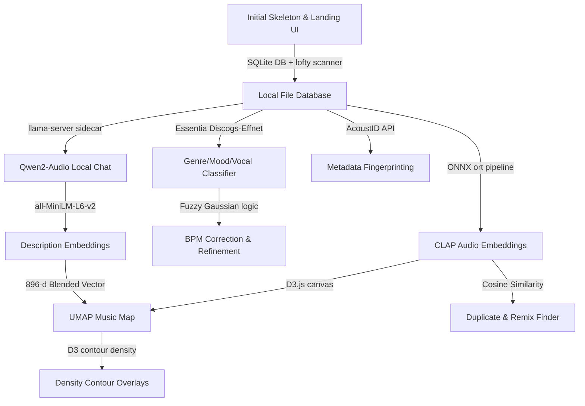

## [HistoryAnalyzerEarly, 2026-06-08T11:05:00+02:00]

# Repository History Review: Early History (d224289 to 237fc79)

**Date**: June 8, 2026  
**Analyzer**: `HistoryAnalyzerEarly` (subagent `agy.early`)  
**Commit Range**: `d224289` to `237fc79` (inclusive; 273 commits total)  
**Timeline**: May 29, 2026 – June 3, 2026

---

## Executive Summary
The early history of the Deep Cuts repository documents the rapid evolution of the application from a bare Tauri v2 desktop skeleton into a highly sophisticated local audio analyzer and visualization engine. 

Within a span of 5 days and 273 commits, the repository established its core SQLite database model, built a parallel file scanner, introduced ONNX-powered machine learning inference for CLAP embeddings and Essentia classifiers, implemented a local LLM-powered audio describer (Qwen2-Audio via a bundled `llama-server` sidecar), migrated the frontend to the "Sonic Glitch" design system built on custom Svelte 5 reactive stores, and developed a visual UMAP Music Map utilizing logarithmic contour overlays and playlisting.

---

## Logical Phases of Development

### Phase 1: Core Foundation & Media Player UI
* **Commit Range**: `d224289` – `cb889da` (Commits 1 to 10)
* **Theme**: Project initialization, database setup, and core media player dashboard.
* **Key Features**:
  * Scaffolded a Tauri v2 Rust backend with macOS configurations and Svelte 5 static SPA frontend.
  * Initialized local SQLite database (`deep_cuts.db`) to store tracks and persist user theme selections.
  * Implemented monitored directories management and a parallel file scanner in Rust utilizing the `lofty` crate to parse audio metadata (ID3 tags).
  * Built a resizable split-pane layout with a custom WaveSurfer.js player supporting spectrogram rendering and toggleable detail panes.
  * Created the initial DSP pass (basic silence and RMS peak detection) and `.dc.json` sidecar serialization for portable metadata.
* **Architectural Decisions**:
  * Decoupled heavy I/O operations (scanning, lofty metadata extraction) from the Tauri main thread by introducing a dedicated background loop.
  * Set up `.dc.json` sidecars created adjacent to media files to maintain a dual-source-of-truth metadata model (local DB and directory-portable sidecars).
* **Documentation & Skills**:
  * Ported `CLAUDE.md`, `AGENTS.md` and basic developer skills from the prototype to enforce coding guidelines.
  * Introduced `skills/dev-guidelines/SKILL.md` and `skills/query-db/SKILL.md` to help developers check environment configurations and inspect the SQLite database directly.

---

### Phase 2: Neural Embeddings & 2D Music Map Visualization
* **Commit Range**: `20a8e4a` – `2875554` (Commits 11 to 44)
* **Theme**: Audio embedding pipeline generation and interactive UMAP projections.
* **Key Features**:
  * Created a Python-based model staging process (`tools/`) to export CLAP (Contrastive Language-Audio Pretraining) models to ONNX.
  * Integrated ONNX Runtime (`ort`) in the Rust backend to run local CLAP audio inference.
  * Developed a Svelte 5 interactive UMAP Music Map utilizing a D3.js canvas with smooth zoom, pan, and dynamic genre-coloring.
  * Implemented custom range sliders and popover controls for BPM and Key dashboard filters.
  * Optimized analysis pipeline throughput: introduced a seek-aware producer-consumer pipeline for CLAP processing, implemented 3-window temporal mean pooling for embeddings, and added wall-clock throughput estimation.
  * Refactored the backend commands, extracting data repositories and decoupling coordinators into a clean domain model.
  * Debugged and resolved a crucial CLAP embedding similarity issue (removing per-clip mel normalization that distorted distance calculations, validated via the `bach_vs_metallica.py` script).
* **Architectural Decisions**:
  * Adopted UMAP as the primary method to project high-dimensional audio embeddings (512-d) to a browseable 2D coordinate space.
  * Spooled analysis jobs in-memory and decoupled them from database locks, running audio decoding and model execution concurrently.
* **Documentation & Skills**:
  * Added `skills/add-ipc-command/SKILL.md` and `skills/db-migration/SKILL.md` to guide schema updates.
  * Drafted the first version of `skills/add-analysis-pass/SKILL.md` to standardize how new inference steps are integrated.

---

### Phase 3: Classifier Models, BPM Correction, & AI Research
* **Commit Range**: `d5f36a4` – `a50639a` (Commits 45 to 69)
* **Theme**: Introducing deep audio classifiers (Essentia), corrective BPM logic, and local LLM descriptions.
* **Key Features**:
  * Ported Essentia Discogs-Effnet models to classify tracks by genre, mood, and vocal/instrumental likelihood.
  * Introduced `bpm_correction` and `bpm_refinement` passes using genre constraints to correct double/half-BPM errors.
  * Integrated a local Qwen2-Audio listener pass and a Description Embeddings pass (using `all-MiniLM-L6-v2` ONNX) to support natural language queries.
  * Blended CLAP vectors (512-d) and description embeddings (384-d) into a combined 896-d feature vector for projection.
  * Created a python `projection_comparison_tool` to visually evaluate different UMAP projection parameters.
  * Wrote extensive product brainstorming files and feature evaluations for DJ performance, playlists, duplicate detection, and visual contour maps.
* **Architectural Decisions**:
  * Enforced pipeline execution ordering: Essentia and BPM correction must run before Qwen (allowing Qwen to ingest verified BPM/genre metadata), and Qwen must run before Description Embeddings (which embed Qwen's text output).
  * Added `pass_version` column to schemas to support automatic invalidation and backfilling when model versions change.

---

### Phase 4: Svelte 5 "Sonic Glitch" UI Redesign & Store Architecture
* **Commit Range**: `f7c6bc1` – `bca92b5` (Commits 70 to 100)
* **Theme**: UI overhaul and frontend state refactoring.
* **Key Features**:
  * Designed the "Sonic Glitch" system utilizing CSS variables (`--sg-*`) with Dark, Light, and Accessible High-Contrast themes.
  * Extracted state logic from monolithic pages into cohesive Svelte 5 store classes (`PlayerStore`, `FilterStore`, `ThemeStore`, `UIStore`) driven by `$state` and `$derived` runes.
  * Built complete unit test suites for all stores using Vitest.
  * Overhauled core views into modular layouts: app layout shell, persistent `PlayerBar`, responsive `FilterSidebar`, full-screen D3 `MusicMap` canvas, and metadata-rich `TrackDetailPane`.
  * Added monitored-folder multi-select capabilities.
* **Architectural Decisions**:
  * Standardized class-based reactive stores on the frontend, eliminating prop-drilling and legacy Svelte writable store subscriptions.
  * Locked the application layout to the viewport to provide a native-feeling desktop experience, handling local scrolling only in list components.

---

### Phase 5: Search Enhancements, UMAP Robustness, & Backend Pass Modularization
* **Commit Range**: `62580ac` – `df436ea` (Commits 101 to 139)
* **Theme**: Hybrid search engines, coordinate clipping, and trait-based pipeline refactoring.
* **Key Features**:
  * Implemented an IDF-scaled hybrid search combining FTS text matching and CLAP embedding similarity.
  * Replaced center-cropping CLAP window selection with loudest-region peak finding.
  * Added percentile clipping (p1-p99) to UMAP projections to prevent outlier files from squashing the rest of the map.
  * Added fast deterministic PCA projection fallback options and algorithm toggles.
  * Refactored the monolithic `analysis.rs` file into a modular, registry-driven system where each pass is a submodule implementing the `AnalysisPass` trait.
  * Created a unified `PassSpec` registry and generic lifecycle helpers.
* **Architectural Decisions**:
  * The `PassSpec` registry was designed to automatically manage database backfilling, stale invalidation, dynamic sidecar synchronization (import/export), and IPC reset routing based on version bumps.

---

### Phase 6: Duplicates, Models Downloader, & Local Multimodal Chat
* **Commit Range**: `c1f371b` – `806e289` (Commits 140 to 196)
* **Theme**: User utilities, resumable model downloading, and sidecar LLM servers.
* **Key Features**:
  * Developed a `Duplicates` page using CLAP cosine similarity to identify identical or remixed tracks.
  * Implemented an in-app Model Downloader in Rust supporting resumable, chunked downloads from Hugging Face with SHA256 checksum validation.
  * Bundled a `llama-server` sidecar to run Qwen2-Audio locally with Metal acceleration on macOS, using dynamic staging of `.dylib` libraries.
  * Extracted and cached embedded album cover art directly to the database.
* **Architectural Decisions**:
  * Avoided bundling heavy model weights (~6.3 GB) directly in the application package; instead, they are downloaded on-demand and validated locally.
  * Dynamically allocated open ports to run the `llama-server` sidecar to prevent conflicts with other services.

---

### Phase 7: AcoustID Metadata, Playlists, D3 Overlays, & Advanced Analysis Post-Processing
* **Commit Range**: `7001fbf` – `237fc79` (Commits 197 to 272)
* **Theme**: Metadata enrichment, contour maps, and joint Key/BPM processing.
* **Key Features**:
  * Integrated AcoustID fingerprinting and metadata lookup.
  * Implemented custom M3U playlist exports using macOS native file dialogs and saved search criteria.
  * Added a visual comparison statistics drawer.
  * Integrated a WaveSurfer region selector in the Chat panel to slice sub-clips for Qwen2-Audio context.
  * Persisted chat session histories with FTS5 text search.
  * Added D3-based `MoodRadar` canvas displays and density contour overlays (D3 contour density maps).
  * Built joint key and BPM preprocessors using fuzzy Gaussian corrections.
  * Programmatically skipped downstream neural passes for files classified by Essentia as non-music.
* **Architectural Decisions**:
  * Chained preprocessing steps to verify and correct BPM/Key parameters before committing results to SQLite, ensuring higher consistency for DJ metadata writebacks.
  * Utilized SQLite's FTS5 virtual table extension for low-latency chat session indexing.

---

## Documentation & Skill Drift Analysis

A major objective of this review is analyzing "Concept Drift" — the divergence between active codebase architecture and developer-facing files under `doc/` and `skills/`.

### 1. The Evolution of the Analysis Pass Guide
* **Midpoint State (`237fc79`)**:
  * The analysis pipeline only supported per-track analysis (the `AnalysisPass` trait).
  * The `skills/add-analysis-pass/SKILL.md` file at this commit reflected this simplicity, listing 7 passes (`audio_analysis`, `bpm_correction`, `clap`, `qwen`, `description_embed`, `essentia`, `bpm_refinement`) and only two common mistakes.
* **Current State**:
  * The codebase introduced a second pass shape: `BatchAnalysisPass` (for global clustering or I/O heavy operations like SAX structure clustering).
  * The current version of `skills/add-analysis-pass/SKILL.md` has evolved substantially to document `BatchAnalysisPass`, automatic and manual pause atomics, metrics logging (`log_pipeline_metric` and `log_system_event`), and contains 15+ troubleshooting entries.
* **Concept Drift Observation**: 
  * If an agent working at this midpoint tried to add a batch pass, they would find no framework support in the Rust codebase. Conversely, an agent referencing the midpoint version of `add-analysis-pass` would lack instructions on handling pause states, transaction management, and the `run_id` metric thread.

### 2. Proposal Relocations and Obsolescence
* **Proposals Lifecycle**:
  * During the early phases, several speculative brainstorming files were created directly under `doc/` (e.g. `doc/semantic_feature_brainstorm.md`, `doc/ui_ideas.md`, `doc/music_map_improvements.md`).
  * As these ideas moved closer to implementation or review, they were reorganized into `/doc/proposals/` or `/doc/architecture/` (e.g., `doc/proposals/semantic_feature_brainstorm.md`, `doc/proposals/map_layouts.md`).
  * Implementations that were fully completed saw their design docs deleted (e.g., `qwen_description_pass.md` and the model download design docs) to keep the documentation directory clean.
  * **Current Risk**: Proposals that remain in the repo (like `doc/proposals/user_edit_song.md` or `doc/proposals/track_comparison_design.md`) represent partially-implemented ideas and could lead an agent to believe these features are fully active in the codebase unless they cross-reference the database schemas.

### 3. Database Schema and Sidecar Synchronization
* **Refactoring Shift**:
  * In Phase 5, sidecar serialization was refactored to be dynamically driven by the `PassSpec` registry. Prior to this, adding a new database field required manual updates in `scanner/sidecar.rs` to write JSON fields.
  * **Current Risk**: Any agent attempting to manually update `scanner/sidecar.rs` for new columns (based on pre-Phase 5 patterns) would be introducing redundant code. They must follow the registry-driven method documented in the updated skill file.

---

## Architectural Evolution Summary

### Key Architectural Milestones:
1. **From Ad-hoc to Registry Pattern**: The migration of the analysis pipeline from a manual sequential loop to a trait-based `PASS_REGISTRY` in Phase 5 is the most significant backend design upgrade. It unified schema validation, sidecar imports, and error handling.
2. **Class-Based Svelte 5 Stores**: The transition from prop-drilling and legacy writable stores to class-based reactive stores driven by Svelte 5 runes (`$state`/`$derived`) fundamentally simplified frontend development and enabled robust test suites with Vitest.
3. **GPU-Accelerated Local Sidecars**: Bundling `llama-server` and resolving shared libraries dynamically on macOS represents a sophisticated desktop-app approach, balancing binary size with high-performance local inference.
