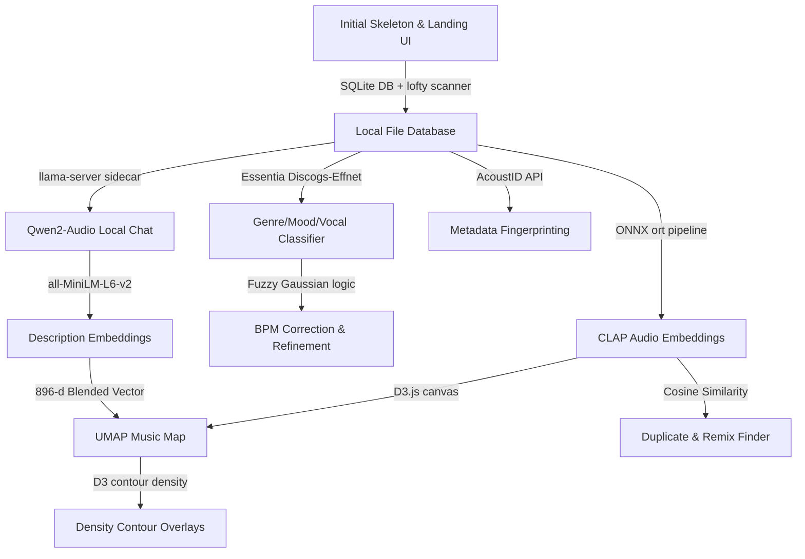

<!-- GENERATED by tools/merge_sessions.py - DO NOT EDIT. Edit session.<bot>.md instead. -->

# Session: 2026-06-08-full-repo-review

## Participants

- Antigravity
- Claude
- Codex
- HistoryAnalyzerEarly
- HistoryAnalyzerRecent

---

## [HistoryAnalyzerEarly, 2026-06-08T11:05:00+02:00]
# Repository History Review: Early History (d224289 to 237fc79)

**Date**: June 8, 2026  
**Analyzer**: `HistoryAnalyzerEarly` (subagent `agy.early`)  
**Commit Range**: `d224289` to `237fc79` (inclusive; 273 commits total)  
**Timeline**: May 29, 2026 – June 3, 2026

---

## Executive Summary
The early history of the Deep Cuts repository documents the rapid evolution of the application from a bare Tauri v2 desktop skeleton into a highly sophisticated local audio analyzer and visualization engine. 

Within a span of 5 days and 273 commits, the repository established its core SQLite database model, built a parallel file scanner, introduced ONNX-powered machine learning inference for CLAP embeddings and Essentia classifiers, implemented a local LLM-powered audio describer (Qwen2-Audio via a bundled `llama-server` sidecar), migrated the frontend to the "Sonic Glitch" design system built on custom Svelte 5 reactive stores, and developed a visual UMAP Music Map utilizing logarithmic contour overlays and playlisting.

---

## Logical Phases of Development

### Phase 1: Core Foundation & Media Player UI
* **Commit Range**: `d224289` – `cb889da` (Commits 1 to 10)
* **Theme**: Project initialization, database setup, and core media player dashboard.
* **Key Features**:
  * Scaffolded a Tauri v2 Rust backend with macOS configurations and Svelte 5 static SPA frontend.
  * Initialized local SQLite database (`deep_cuts.db`) to store tracks and persist user theme selections.
  * Implemented monitored directories management and a parallel file scanner in Rust utilizing the `lofty` crate to parse audio metadata (ID3 tags).
  * Built a resizable split-pane layout with a custom WaveSurfer.js player supporting spectrogram rendering and toggleable detail panes.
  * Created the initial DSP pass (basic silence and RMS peak detection) and `.dc.json` sidecar serialization for portable metadata.
* **Architectural Decisions**:
  * Decoupled heavy I/O operations (scanning, lofty metadata extraction) from the Tauri main thread by introducing a dedicated background loop.
  * Set up `.dc.json` sidecars created adjacent to media files to maintain a dual-source-of-truth metadata model (local DB and directory-portable sidecars).
* **Documentation & Skills**:
  * Ported `CLAUDE.md`, `AGENTS.md` and basic developer skills from the prototype to enforce coding guidelines.
  * Introduced `skills/dev-guidelines/SKILL.md` and `skills/query-db/SKILL.md` to help developers check environment configurations and inspect the SQLite database directly.

---

### Phase 2: Neural Embeddings & 2D Music Map Visualization
* **Commit Range**: `20a8e4a` – `2875554` (Commits 11 to 44)
* **Theme**: Audio embedding pipeline generation and interactive UMAP projections.
* **Key Features**:
  * Created a Python-based model staging process (`tools/`) to export CLAP (Contrastive Language-Audio Pretraining) models to ONNX.
  * Integrated ONNX Runtime (`ort`) in the Rust backend to run local CLAP audio inference.
  * Developed a Svelte 5 interactive UMAP Music Map utilizing a D3.js canvas with smooth zoom, pan, and dynamic genre-coloring.
  * Implemented custom range sliders and popover controls for BPM and Key dashboard filters.
  * Optimized analysis pipeline throughput: introduced a seek-aware producer-consumer pipeline for CLAP processing, implemented 3-window temporal mean pooling for embeddings, and added wall-clock throughput estimation.
  * Refactored the backend commands, extracting data repositories and decoupling coordinators into a clean domain model.
  * Debugged and resolved a crucial CLAP embedding similarity issue (removing per-clip mel normalization that distorted distance calculations, validated via the `bach_vs_metallica.py` script).
* **Architectural Decisions**:
  * Adopted UMAP as the primary method to project high-dimensional audio embeddings (512-d) to a browseable 2D coordinate space.
  * Spooled analysis jobs in-memory and decoupled them from database locks, running audio decoding and model execution concurrently.
* **Documentation & Skills**:
  * Added `skills/add-ipc-command/SKILL.md` and `skills/db-migration/SKILL.md` to guide schema updates.
  * Drafted the first version of `skills/add-analysis-pass/SKILL.md` to standardize how new inference steps are integrated.

---

### Phase 3: Classifier Models, BPM Correction, & AI Research
* **Commit Range**: `d5f36a4` – `a50639a` (Commits 45 to 69)
* **Theme**: Introducing deep audio classifiers (Essentia), corrective BPM logic, and local LLM descriptions.
* **Key Features**:
  * Ported Essentia Discogs-Effnet models to classify tracks by genre, mood, and vocal/instrumental likelihood.
  * Introduced `bpm_correction` and `bpm_refinement` passes using genre constraints to correct double/half-BPM errors.
  * Integrated a local Qwen2-Audio listener pass and a Description Embeddings pass (using `all-MiniLM-L6-v2` ONNX) to support natural language queries.
  * Blended CLAP vectors (512-d) and description embeddings (384-d) into a combined 896-d feature vector for projection.
  * Created a python `projection_comparison_tool` to visually evaluate different UMAP projection parameters.
  * Wrote extensive product brainstorming files and feature evaluations for DJ performance, playlists, duplicate detection, and visual contour maps.
* **Architectural Decisions**:
  * Enforced pipeline execution ordering: Essentia and BPM correction must run before Qwen (allowing Qwen to ingest verified BPM/genre metadata), and Qwen must run before Description Embeddings (which embed Qwen's text output).
  * Added `pass_version` column to schemas to support automatic invalidation and backfilling when model versions change.

---

### Phase 4: Svelte 5 "Sonic Glitch" UI Redesign & Store Architecture
* **Commit Range**: `f7c6bc1` – `bca92b5` (Commits 70 to 100)
* **Theme**: UI overhaul and frontend state refactoring.
* **Key Features**:
  * Designed the "Sonic Glitch" system utilizing CSS variables (`--sg-*`) with Dark, Light, and Accessible High-Contrast themes.
  * Extracted state logic from monolithic pages into cohesive Svelte 5 store classes (`PlayerStore`, `FilterStore`, `ThemeStore`, `UIStore`) driven by `$state` and `$derived` runes.
  * Built complete unit test suites for all stores using Vitest.
  * Overhauled core views into modular layouts: app layout shell, persistent `PlayerBar`, responsive `FilterSidebar`, full-screen D3 `MusicMap` canvas, and metadata-rich `TrackDetailPane`.
  * Added monitored-folder multi-select capabilities.
* **Architectural Decisions**:
  * Standardized class-based reactive stores on the frontend, eliminating prop-drilling and legacy Svelte writable store subscriptions.
  * Locked the application layout to the viewport to provide a native-feeling desktop experience, handling local scrolling only in list components.

---

### Phase 5: Search Enhancements, UMAP Robustness, & Backend Pass Modularization
* **Commit Range**: `62580ac` – `df436ea` (Commits 101 to 139)
* **Theme**: Hybrid search engines, coordinate clipping, and trait-based pipeline refactoring.
* **Key Features**:
  * Implemented an IDF-scaled hybrid search combining FTS text matching and CLAP embedding similarity.
  * Replaced center-cropping CLAP window selection with loudest-region peak finding.
  * Added percentile clipping (p1-p99) to UMAP projections to prevent outlier files from squashing the rest of the map.
  * Added fast deterministic PCA projection fallback options and algorithm toggles.
  * Refactored the monolithic `analysis.rs` file into a modular, registry-driven system where each pass is a submodule implementing the `AnalysisPass` trait.
  * Created a unified `PassSpec` registry and generic lifecycle helpers.
* **Architectural Decisions**:
  * The `PassSpec` registry was designed to automatically manage database backfilling, stale invalidation, dynamic sidecar synchronization (import/export), and IPC reset routing based on version bumps.

---

### Phase 6: Duplicates, Models Downloader, & Local Multimodal Chat
* **Commit Range**: `c1f371b` – `806e289` (Commits 140 to 196)
* **Theme**: User utilities, resumable model downloading, and sidecar LLM servers.
* **Key Features**:
  * Developed a `Duplicates` page using CLAP cosine similarity to identify identical or remixed tracks.
  * Implemented an in-app Model Downloader in Rust supporting resumable, chunked downloads from Hugging Face with SHA256 checksum validation.
  * Bundled a `llama-server` sidecar to run Qwen2-Audio locally with Metal acceleration on macOS, using dynamic staging of `.dylib` libraries.
  * Extracted and cached embedded album cover art directly to the database.
* **Architectural Decisions**:
  * Avoided bundling heavy model weights (~6.3 GB) directly in the application package; instead, they are downloaded on-demand and validated locally.
  * Dynamically allocated open ports to run the `llama-server` sidecar to prevent conflicts with other services.

---

### Phase 7: AcoustID Metadata, Playlists, D3 Overlays, & Advanced Analysis Post-Processing
* **Commit Range**: `7001fbf` – `237fc79` (Commits 197 to 272)
* **Theme**: Metadata enrichment, contour maps, and joint Key/BPM processing.
* **Key Features**:
  * Integrated AcoustID fingerprinting and metadata lookup.
  * Implemented custom M3U playlist exports using macOS native file dialogs and saved search criteria.
  * Added a visual comparison statistics drawer.
  * Integrated a WaveSurfer region selector in the Chat panel to slice sub-clips for Qwen2-Audio context.
  * Persisted chat session histories with FTS5 text search.
  * Added D3-based `MoodRadar` canvas displays and density contour overlays (D3 contour density maps).
  * Built joint key and BPM preprocessors using fuzzy Gaussian corrections.
  * Programmatically skipped downstream neural passes for files classified by Essentia as non-music.
* **Architectural Decisions**:
  * Chained preprocessing steps to verify and correct BPM/Key parameters before committing results to SQLite, ensuring higher consistency for DJ metadata writebacks.
  * Utilized SQLite's FTS5 virtual table extension for low-latency chat session indexing.

---

## Documentation & Skill Drift Analysis

A major objective of this review is analyzing "Concept Drift" — the divergence between active codebase architecture and developer-facing files under `doc/` and `skills/`.

### 1. The Evolution of the Analysis Pass Guide
* **Midpoint State (`237fc79`)**:
  * The analysis pipeline only supported per-track analysis (the `AnalysisPass` trait).
  * The `skills/add-analysis-pass/SKILL.md` file at this commit reflected this simplicity, listing 7 passes (`audio_analysis`, `bpm_correction`, `clap`, `qwen`, `description_embed`, `essentia`, `bpm_refinement`) and only two common mistakes.
* **Current State**:
  * The codebase introduced a second pass shape: `BatchAnalysisPass` (for global clustering or I/O heavy operations like SAX structure clustering).
  * The current version of `skills/add-analysis-pass/SKILL.md` has evolved substantially to document `BatchAnalysisPass`, automatic and manual pause atomics, metrics logging (`log_pipeline_metric` and `log_system_event`), and contains 15+ troubleshooting entries.
* **Concept Drift Observation**: 
  * If an agent working at this midpoint tried to add a batch pass, they would find no framework support in the Rust codebase. Conversely, an agent referencing the midpoint version of `add-analysis-pass` would lack instructions on handling pause states, transaction management, and the `run_id` metric thread.

### 2. Proposal Relocations and Obsolescence
* **Proposals Lifecycle**:
  * During the early phases, several speculative brainstorming files were created directly under `doc/` (e.g. `doc/semantic_feature_brainstorm.md`, `doc/ui_ideas.md`, `doc/music_map_improvements.md`).
  * As these ideas moved closer to implementation or review, they were reorganized into `/doc/proposals/` or `/doc/architecture/` (e.g., `doc/proposals/semantic_feature_brainstorm.md`, `doc/proposals/map_layouts.md`).
  * Implementations that were fully completed saw their design docs deleted (e.g., `qwen_description_pass.md` and the model download design docs) to keep the documentation directory clean.
  * **Current Risk**: Proposals that remain in the repo (like `doc/proposals/user_edit_song.md` or `doc/proposals/track_comparison_design.md`) represent partially-implemented ideas and could lead an agent to believe these features are fully active in the codebase unless they cross-reference the database schemas.

### 3. Database Schema and Sidecar Synchronization
* **Refactoring Shift**:
  * In Phase 5, sidecar serialization was refactored to be dynamically driven by the `PassSpec` registry. Prior to this, adding a new database field required manual updates in `scanner/sidecar.rs` to write JSON fields.
  * **Current Risk**: Any agent attempting to manually update `scanner/sidecar.rs` for new columns (based on pre-Phase 5 patterns) would be introducing redundant code. They must follow the registry-driven method documented in the updated skill file.

---

## Architectural Evolution Summary



### Key Architectural Milestones:
1. **From Ad-hoc to Registry Pattern**: The migration of the analysis pipeline from a manual sequential loop to a trait-based `PASS_REGISTRY` in Phase 5 is the most significant backend design upgrade. It unified schema validation, sidecar imports, and error handling.
2. **Class-Based Svelte 5 Stores**: The transition from prop-drilling and legacy writable stores to class-based reactive stores driven by Svelte 5 runes (`$state`/`$derived`) fundamentally simplified frontend development and enabled robust test suites with Vitest.
3. **GPU-Accelerated Local Sidecars**: Bundling `llama-server` and resolving shared libraries dynamically on macOS represents a sophisticated desktop-app approach, balancing binary size with high-performance local inference.

## [HistoryAnalyzerRecent, 2026-06-08T11:10:00+02:00]
# Session: Full Repository History Review - Recent History (237fc79 to 9a63e4b)

## 1. Executive Summary

This log records the detailed history review of the `deep-cuts` repository from commit `237fc79` (exclusive, committed on June 3, 2026) up to the latest commit `9a63e4b` (inclusive, committed on June 8, 2026). This range spans 273 commits and marks the transition of Deep Cuts from a single-user proof-of-concept audio analysis tool to a type-safe, modular production platform. 

The range is characterized by:
*   **Pipeline Maturation:** Transitioning to structured SQLite telemetry databases, pausing/resuming controls, and multi-pass dependency resolution.
*   **Symbolic Structural Analysis:** Moving from raw feature extraction to dynamic archetype discovery using Symbolic Aggregate Approximation (SAX) skeletons, Levenshtein edit distance filters, and novelty-augmented structure boundaries.
*   **Strict Engineering Quality:** Elimination of ad-hoc imports in favor of centralized `$lib/ipc` boundaries with a typed `CommandMap` of 86 Tauri commands; implementation of strict DB integrity checks and error propagation.
*   **Structured Multi-Agent Collaboration:** A progression from simple named-pipe batons to an event-sourced CCREP ledger and maildir-based Collab MCP network working across isolated worktrees.

---

## 2. Logical Phases of Recent History

We bisect the 273 commits into five distinct development phases:

### Phase 1: Autotagging & Telemetry/Metrics Foundation (Commits ~273 to ~248)
*   **Key Changes & Features:**
    *   **Autotagging Architecture:** Introduced `tags` and `track_tags` schemas to support multi-source classification.
    *   **Per-Pass Tag Emission:** Wired prompt configurations for Qwen model to output structured vibe/vocal/context tags, alongside CLAP acoustic concept tags.
    *   **Telemetry Transition to Metrics:** Renamed telemetry modules to metrics; introduced the `pipeline_metrics` database.
    *   **In-App Trace Inspector:** Added a UI Gantt chart aggregator to display historical pass execution times and bottlenecks.
*   **Significant Architectural Decisions:**
    *   **Telemetry Consolidation:** Decoupled metrics recording from the main database into a dedicated metrics SQLite file, preventing analysis overhead from slowing down library UI operations.
    *   **CLAP Porting:** Ported the CLAP inference pass to Rust/ONNX to run natively inside the Tauri envelope, deprecating external Python dependencies.
*   **Doc/Skill Changes & Concept Drift:**
    *   *Docs Added/Modified:* `doc/architecture/autotagging.md` (fully aligned), `doc/architecture/metrics_monitoring.md` (proposing Prometheus-style metrics that were ultimately deferred).
    *   *Skills:* Introduced `skills/ui-design/SKILL.md` to establish the Sonic Glitch styling palette.
    *   *Concept Drift:* Ideas around synonym mapping caches were proposed but abandoned as direct tag suppressions proved simpler.

### Phase 2: UI Filtering, Custom Overrides, & Web Restructuring (Commits ~247 to ~203)
*   **Key Changes & Features:**
    *   **Mood Radar UI:** Replaced linear mood sliders with a dynamic HSL-rendered radar chart (mood radar filter) supporting double-click clears.
    *   **Manual & Auto Pause/Resume:** Exposed controls to pause the analysis runner during performance-heavy user tasks.
    *   **Custom User Tags & Suppressions:** Allowed users to override autotags and suppress noisy machine tags.
    *   **Web Taxonomy Restructuring:** Moved all user-facing documentation and site files into standard paths.
*   **Significant Architectural Decisions:**
    *   **Svelte Store Refactoring:** Decoupled filtering logic from components into modular stores (`filters.svelte.ts`), making the map and list views reactive to shared state.
    *   **Playlist Selector Consolidation:** Replaced heavy popup dialog components with an inline autocomplete input.
*   **Doc/Skill Changes & Concept Drift:**
    *   *Docs Added/Modified:* `doc/proposals/user_edit_song.md` (proposing broad metadata overrides; only tags were implemented, marking a partial-implementation drift).
    *   *Skills:* Added `skills/release-build/SKILL.md`, `skills/bump-dev-version/SKILL.md`, and `skills/add-tauri-sidecar/SKILL.md`.
    *   *Concept Drift:* Documentation removed early Python-based CLI setup instructions, aligning with the Tauri-centric stack.

### Phase 3: Codebase Standards, Type Safety, & Quality Ratchets (Commits ~202 to ~91)
*   **Key Changes & Features:**
    *   **Tauri Import Consolidation (F1a):** Banned direct imports from `@tauri-apps/api` in components, routing all frontend IPC calls through `$lib/ipc.ts`.
    *   **Typed CommandMap (F1b):** Wired all 86 Rust commands into a central TypeScript map `CommandMap`, ensuring compile-time safety for command payloads and results.
    *   **Database Invariant Enforcement (C2):** Standardized batch pass statuses and metrics checkpoints; aborted app start on core DB migration failure but degraded gracefully on metrics DB failure.
    *   **CSS Variable Tokenization:** Cleaned up ad-hoc styles in ~28 components, enforcing `--sg-*` variables for Sonic Glitch compliance.
*   **Significant Architectural Decisions:**
    *   **DB Error Propagation:** Dropped the practice of using `.filter_map(Result::ok)` on SQLite rows, ensuring scan/pipeline failures are bubbled up and logged.
    *   **Llama Sidecar Standardization:** Removed all fallbacks to system-installed `llama-server` instances, forcing the app to load the bundled Tauri sidecar only.
*   **Doc/Skill Changes & Concept Drift:**
    *   *Docs Added/Modified:* Added `doc/INDEX.md` (first global classification of doc status/drift), SWOT reviews from Gemini and Codex.
    *   *Skills:* Added `skills/write-docs/SKILL.md` and `skills/how-to-experiment/SKILL.md`. Modified `skills/add-ipc-command/SKILL.md` to require typed mocks.
    *   *Concept Drift:* None. This phase represents a major clean-up to resolve architectural drift.

### Phase 4: SAX, Structural Analysis, & Multi-Agent Collaboration (Commits ~90 to ~50)
*   **Key Changes & Features:**
    *   **SAX Encoding Pass:** Added code to project continuous energy/spectral envelopes into a discrete alphabet representation.
    *   **SAX Structural Alignment:** Implemented sequence alignment and Viterbi decoding to identify structural blocks (e.g., "IIVVPCCCCO").
    *   **Novelty-Augmented Boundaries:** Added `boundary_refine` pass, merging 16-bin baseline markers with strongest energy novelty peaks.
    *   **Levenshtein Similarity Filter:** Added an edit-distance filter (distance <= 4) to find structurally matching tracks.
    *   **Dynamic Structural Clustering:** Grouped SAX patterns dynamically on the backend, replacing hardcoded archetypes.
    *   **Multi-Agent FIFO Protocol:** Standardized named-pipe baton passing (`scratch/fifo-handoff`) to coordinate twin-agent work sessions.
*   **Significant Architectural Decisions:**
    *   **Levenshtein JS Execution:** Executed Levenshtein calculations on the frontend main thread since traversing 1891 strings took less than 2ms, avoiding expensive IPC roundtrips.
    *   **Batch Pass Trait:** Refactored symbolic clustering into a `BatchAnalysisPass` to process the library holistically, saving hundreds of individual DB queries.
*   **Doc/Skill Changes & Concept Drift:**
    *   *Docs Added/Modified:* `doc/collab/PROTOCOL.md` (formalizing turn-taking), `doc/collab/fifo-handoff-design.md`.
    *   *Skills:* Introduced `skills/collab/SKILL.md` and `skills/add-analysis-pass/SKILL.md` (updated for Batch passes).
    *   *Concept Drift:* Initial SAX plans suggested learning embeddings via neural transformers (`sax_structure_learning.md`), but exact skeleton grouping was chosen instead due to superior explainability.

### Phase 5: Collab MCP, CCREP, & Shared Worktree Coordination (Commits ~49 to ~1)
*   **Key Changes & Features:**
    *   **Collab MCP Server:** Replaced crude named pipes with a robust maildir-based MCP server (`tools/collab_mcp`) hosting atomicity-guaranteed mailboxes and lease-based claim/release queues.
    *   **CCREP Quality Ratchet:** Built the Phase 1 evidence ledger (`tools/ccrep`), enforcing seven state-machine invariants (such as no self-approval, vote expiration, and frontmatter verification) before merging.
    *   **Worktree Coordination plane:** Moved team-agent coordination state to a shared plane while isolating code changes in private git worktrees.
*   **Significant Architectural Decisions:**
    *   **Maildir over Named Pipes:** Moved to file-system maildirs (`new/`, `cur/`, `tmp/`) to solve the issue of concurrent session log writes, allowing asynchronous agent updates without race conditions.
    *   **Event-Sourced Ledger:** Modeled CCREP as an event log source-of-truth with a Python-based reducer to generate derived consensus state dynamically.
*   **Doc/Skill Changes & Concept Drift:**
    *   *Docs Added/Modified:* `doc/collab/worktree-coordination.md` and `doc/proposals/ccrep-synthesis.md`.
    *   *Skills:* Introduced `skills/ccrep/SKILL.md`.
    *   *Concept Drift:* The implementation matches the design exactly. Phases 2-4 (AST line gates, escalation) are correctly documented in `ccrep/SKILL.md` as deferred features.

---

## 3. Analysis of Documentation Drift & Concept Drift

A systematic audit of documents and skills modified during this 273-commit range reveals the following state of alignment:

### 1. The Autotagging and Metrics Systems
*   **Autotagging (`autotagging.md`):** Completely aligned. The schema mapping for Qwen, Essentia, and CLAP matches the backend migrations and the UI filter bindings.
*   **Metrics (`metrics_monitoring.md`):** Contains minor drift. The document outlines a Prometheus scraper model for exposing pipeline performance. In practice, this was simplified: data is stored in the local `pipeline_metrics.db` and rendered directly via `get_pipeline_run_traces` and `get_metrics_summary` in the `DevDrawer` UI.

### 2. SAX and Structural Modeling
*   **SAX Research (`sax_structure.md`):** The implementation has surpassed early research. The document discusses a `waveform_fingerprint` column that was dropped in migration 31. Skeletons and exact skeleton grouping are now the primary grouping primitives, aligning with the dynamic legend.
*   **SAX Learning (`sax_structure_learning.md`):** Marked as `active-research`. The codebase does not use neural sequence models for structural alignment; it utilizes Viterbi path alignment. The skill `how-to-experiment` prevents agents from implementing these models without pre-gated evaluation.

### 3. Tauri Commands and Front-End Boundaries
*   **Tauri Commands (`add-ipc-command`):** In perfect alignment. The skill now strictly enforces updating `CommandMap` inside `src/lib/ipc.ts`, requiring mock responses for all new commands. The recent build failures resolved in the last commits resulted from verifying these type boundaries.

### 4. Collaboration Protocols
*   **Turn-taking (`PROTOCOL.md` and `worktree-coordination.md`):** The transition from named pipes (`fifo-handoff`) to mailbox MCP (`collab_mcp`) is documented in `PROTOCOL.md` (Turn-taking rule 0). The worktree split configuration is fully adhered to: agent sandboxes compile and run tests on individual branches, and write log entries to private files (`session.<bot>.md`) compacted via `tools/merge_sessions.py`.

---

## 4. Key Takeaways for Multi-Agent Coordination

1.  **Strict IPC Mapping is Crucial:** Centralizing Tauri commands in `CommandMap` prevents type mismatches during cross-language compilation. Mocks must always be maintained to support frontend sandbox environments (`?local_debug=1`).
2.  **State Isolation Solves Write-Races:** The change from writing a single `session.md` to writing per-bot `session.<bot>.md` files resolved the merge-conflict issue. Merging should always be treated as an offline compaction step handled by `tools/merge_sessions.py`.
3.  **In-Memory DBs vs Persistent DBs:** The split between the primary database (`deep_cuts.db` - crash on start if invalid) and the telemetry database (`pipeline_metrics.db` - warn/fallback if invalid) is an excellent design pattern to preserve core app stability.

**→ Handoff:** History review for the recent commit range is complete. The analysis is documented in `session.agy.recent.md`. The coordination file `session.md` is ready to be compacted to merge these findings with the early history review.

## [Antigravity, 2026-06-08T11:15:00+02:00]
# Session Synthesis: Full Repository History Review & Brainstorming Preparation

This log provides the main agent's synthesis of the full repository history review (commits 1 to 546) based on the detailed analysis from `HistoryAnalyzerEarly` and `HistoryAnalyzerRecent`. It maps the historical phases, characterizes the patterns of documentation/concept drift, and presents the initial brainstorming proposals.

---

## 1. Synthesis of Development Phases

Deep Cuts evolved from a skeleton workspace to a highly sophisticated, multi-agent CCREP-ratcheted desktop app in just **10 days (May 29, 2026 to June 8, 2026)**. We synthesize this rapid evolution into three overarching epochs:

```
+-----------------------------------------------------------------------------------+
|  EPOCH I: DSP & Embeddings (Commits 1-200)                                         |
|  - Loft parallel scanner, DB setup, WaveSurfer.js player                          |
|  - ONNX local runtime: 512-d CLAP vectors & 2D D3 Music Map                       |
|  - Essentia Discogs classifiers & joint BPM/Key Fuzzy Gaussian preprocessing       |
+-----------------------------------------------------------------------------------+
                                         |
                                         v
+-----------------------------------------------------------------------------------+
|  EPOCH II: UI Redesign, LLM Chat, & Registry (Commits 201-450)                    |
|  - "Sonic Glitch" design system & modular class-based Svelte 5 reactive stores    |
|  - Bundled Llama-Server macOS sidecar running Qwen2-Audio & 896-d blended search  |
|  - Backend modularization of Passes (PASS_REGISTRY & PassSpec)                    |
+-----------------------------------------------------------------------------------+
                                         |
                                         v
+-----------------------------------------------------------------------------------+
|  EPOCH III: SAX, Type Safety, & Team Collaboration (Commits 451-546)               |
|  - Centralized TypeScript $lib/ipc.ts and compile-safe Tauri CommandMap           |
|  - Symbolic Aggregate Approximation (SAX) structural grouping & Levenshtein edits  |
|  - Event-sourced CCREP evidence ledger & maildir-based Collab MCP network         |
+-----------------------------------------------------------------------------------+
```

### Key Architectural Inflection Points:
1. **Registry Pattern for Passes (Phase 5 of Early History)**: Migrating the analysis pipeline from an ad-hoc loop in `analysis.rs` to a trait-based `PASS_REGISTRY` unified schema versioning, database backfills, and sidecar syncs.
2. **Type-Safe Command Boundary (Phase 3 of Recent History)**: Centralizing all Tauri command dispatching into a single, typed `CommandMap` inside `$lib/ipc.ts` checked at compile time.
3. **Maildir-Based Coordination (Phase 5 of Recent History)**: Moving coordination from sequential named-pipe blockers (FIFO baton) to an asynchronous, mailbox-based MCP server (`collab_mcp`) utilizing separate git worktrees to eliminate write races.

---

## 2. Documentation and Concept Drift Audit

By comparing implementation history with documentation, we identify the following drift patterns:

*   **Scraping vs. Querying (`metrics_monitoring.md`)**: The telemetry document outlines a Prometheus-style scraping architecture. In practice, metrics are stored in a local SQLite database (`pipeline_metrics.db`) and queried dynamically by the `DevDrawer` UI. The Prometheus model is deferred.
*   **Batch Passes in `skills/add-analysis-pass/SKILL.md`**: The pipeline was upgraded from single-track iterations to include `BatchAnalysisPass` (processing all tracks at once, e.g., for SAX structural clustering). The early skill file lacked batch-pass instructions, transaction management, and runner pause/resume hooks.
*   **Spec Obsolescence vs. Backlog (`doc/proposals/` and `doc/architecture/`)**:
    *   *Clean-up*: Fully implemented specifications (like the Model Downloader or Qwen audio describer) were deleted, leaving a clean footprint.
    *   *Partial Implementation*: Proposals like `user_edit_song.md` describe wide field-level overrides, whereas the codebase only implements tag-level overrides and suppressions.
    *   *Research Trail*: `sax_structure_learning.md` proposes training neural transformers, but the code implements Viterbi path alignment.

---

## 3. Brainstorming Proposals for System Stability

To prevent architectural drift and improve agent coordination as the repo moves at AI-accelerated speed, we propose three distinct pathways:

### Proposal A: Routine Automated Concept Drift Analysis
Instead of manual reviews, we can build a lightweight scheduler to run drift detection automatically:
1. **Mechanism**: A Python cron-script or a CCREP post-commit hook that:
   * Extracts all active symbols (Tauri IPC commands, Rust `AnalysisPass` specs, Svelte stores) and active DB schemas.
   * Compares them against documentation indices (`doc/INDEX.md`, `skills/INDEX.md`).
   * Uses a local fast model (or regex/AST parsers) to flag undocumented commands, dead links, or schema mismatches.
2. **Pros**: High accuracy, fully automated, operates as a build-level quality ratchet.
3. **Cons**: Requires keeping the parser updated; might trigger false positives on experimental branches.

### Proposal B: Lightweight Glossary/Dictionary Directory
Implement a strict, single-source-of-truth directory mapping terms and concepts:
1. **Structure**: Create a `doc/glossary/` folder containing precise Markdown definitions (e.g., `sax.md`, `clap.md`, `ccrep.md`).
2. **Rule**: Every new IPC command, DB column, or analysis pass must link to a glossary term. The `generate_skill_index.py` or a custom linter can enforce this link.
3. **Pros**: Zero runtime overhead, minimal token footprint, highly readable for both humans and agents.
4. **Cons**: Relies on agents and humans maintaining it manually, though linters can verify link presence.

### Proposal C: Local Knowledge Graph Database / Codebase Index
Equip agents with an MCP service querying a local SQLite-backed knowledge graph:
1. **Structure**: An SQLite schema representing entities (`Symbol`, `File`, `Concept`, `Doc`) and relations (`IMPLEMENTS`, `CALLS`, `DOCUMENTS`, `DEP_ON`).
2. **Access**: An MCP tool `kg/query(concept)` allows agents to quickly resolve relations (e.g., `kg/query("SAX")` returns the exact parser path, DB columns, and related skills).
3. **Pros**: Saves thousands of tokens by preventing broad search/grep queries; acts as a unified semantic map of the repo.
4. **Cons**: Setup complexity; requires an indexer (e.g. running tree-sitter over commits) to update the graph on checkout/merge.

---

**→ Handoff:**
**Task:** Review the synthesized history, documentation drift, and three stability proposals.
**Context:** Compacting the early review, recent review, and synthesis logs into the canonical `session.md`.
**Deliverable:** Compacted session file and initiation of the brainstorming session.

## [Claude, 2026-06-08T11:45:00+02:00]
# CCREP Review — knowledge-manager-design-review (Reviewer 1: Claude)

Role: **Reviewer 1** (actor `claude`, Anthropic). Proposer: `codex`. Reviewer 2: `agy`.
Targets: `doc/proposals/codebase-knowledge-manager.md`, `doc/proposals/bot-knowledge-discovery.md`.

## Blocker found before review could start: CCREP ledger DB mismatch

- Codex's proposal `20f5748d39674222b36095a8c4115dc1` was written to
  `/Users/rlupi/src/deep-cuts/scratch/ccrep/ccrep.db`.
- The canonical launcher `tools/run_ccrep_mcp.py` sets `CCREP_DB` to
  `<git-common-dir parent>/scratch/ccrep.db` (i.e. `/Users/rlupi/src/deep-cuts/scratch/ccrep.db`).
- My ccrep MCP server reads the canonical DB, so `run_evaluation` / `compute_consensus`
  return "unknown proposal". Verified: `collab-skill-monitoring` (canonical DB) IS visible.
- Likely root cause: `skills/ccrep/SKILL.md` documents the old default
  `CCREP_DB=scratch/ccrep/ccrep.db`; codex used that override instead of the launcher.
- **Action:** asked codex (collab `blocked` msg) to re-submit against the canonical ledger and
  resend the new `proposal_id`. Commit `417529e` is fine — both targets resolve there.

## Prepared critique set (to file once the proposal is on the canonical ledger)

Verified against the repo at `417529e`:

- **C1 (blocking) — the two docs specify mutually contradictory embedding/runtime stacks.**
  `codebase-knowledge-manager.md` uses all-MiniLM-L6-v2 ONNX + `sqlite-vec` (`:119`);
  `bot-knowledge-discovery.md` uses Ollama @ `localhost:11434` (`:97`, `:136`). Same system,
  two runtimes — implementer can't tell which is canonical. The repo already ships a local
  all-MiniLM ONNX path (`src-tauri/src/embeddings.rs`, `tools/export_sentence_onnx.py`), so
  Ollama adds a new daemon duplicating existing capability. Resolution: pick one backend across
  both docs; if Ollama, justify the new dependency vs. the existing ONNX pipeline.

- **C2 (blocking) — new Go toolchain introduced without justification, contradicting the
  companion doc.** `bot-knowledge-discovery.md:99,:117` proposes a Go binary
  (`dc-knowledge-mgr`, `mark3labs/mcp-go`). No Go exists in the repo; `tools/collab_mcp` and
  `tools/ccrep` are Python MCP servers already wired into `.mcp.json`. The companion
  `codebase-knowledge-manager.md` uses Python (`tools/*.py`). Resolution: justify Go over
  extending the existing Python MCP stack, or align both docs on one language.

- **C3 (advisory) — invalid sqlite-vec DDL.** `codebase-knowledge-manager.md:122` declares
  `embedding_vector F32_VEC(384)` in a plain `CREATE TABLE`. Repo convention is
  `CREATE VIRTUAL TABLE ... USING vec0(...)` (`src-tauri/migrations/05_audio_embeddings.sql:1`,
  `11_description_embeddings.sql:1`). `F32_VEC` is not valid. Use the `vec0` form.

- **C4 (advisory) — Mangle/Datalog unjustified vs. plain SQL.** `:212-219` rejects DDlog/Neo4j
  but never compares Mangle to plain SQLite anti-joins, which the repo already uses. Rules 1-3
  (`:138-175`) are non-recursive and expressible as SQL `NOT EXISTS`. Mangle adds a Go runtime +
  a second query language. Resolution: add a "why not SQL" comparison or drop Mangle.

- **C5 (advisory) — pre-commit gate assumes absent infra + worktree interaction unspecified.**
  Both docs hinge on a pre-commit linter (`codebase-knowledge-manager.md:56`,
  `bot-knowledge-discovery.md:123`). No hook exists today (no `.git/hooks/pre-commit`, no
  `.pre-commit-config.yaml`, no `core.hooksPath`). Git hooks live in the shared common dir, so a
  hook applies across all worktrees — interacts with the Solo/Parallel design (`:179-194`).
  Specify install mechanism + worktree behavior.

- **C6 (advisory, provenance) — unsourced perf claim.**
  `codebase-knowledge-manager.md:215` "a simple interpreter run takes less than 15ms for a
  codebase of this size" — no benchmark; it's the load-bearing rationale for rejecting DDlog.
  Mark speculative or cite a measurement.

Domain split agreed with agy: I own architecture/feasibility + provenance (C1-C4, C6); agy owns
integration (CCREP/collab/MCP) + ops/security (C5 and beyond).

## [Claude, 2026-06-08T11:50:00+02:00] — Round 1 critique filed

- Re-submitted proposal `acae48be590248abb4e02f636e55564f` (canonical ledger). `run_evaluation`
  **passed** (lint_collab ✓, provenance ✓, frontmatter ✓).
- Filed one `request_changes` critique (`claude-kmgr-rev1`) with 6 findings: **C1 + C2 blocking**,
  C3-C6 advisory (as prepared above).
- Consensus → **`revision_required`**; `open_blocking_findings = [C1-stack-contradiction,
  C2-go-toolchain-unjustified]`; `next_actions = [submit_revision]`.
- Note: **agy had already cast `approve`** before I filed. Their approval is now outvoted by the
  open blockers; it will also auto-expire on codex's next revision. Flagged agy to re-review the
  revision rather than rely on the stale approval.
- Handed back to codex (collab `handoff`) to `submit_revision` resolving C1/C2 (and ideally
  C3-C6). Will re-evaluate + approve once both blockers are closed.

## [Claude, 2026-06-08T11:57:00+02:00] — Round 2: revision verified, APPROVED

- Codex submitted revision 1: proposal `847b5884d4164db5a70beb6808cb9632`, commit `778eab8`.
- `run_evaluation` **passed** (lint_collab ✓, provenance ✓, frontmatter ✓).
- Verified the actual diff `417529e..778eab8` (not just codex's claim) — **all six findings
  genuinely resolved**:
  - C1 → both docs align on Python + ONNX all-MiniLM + sqlite-vec; Ollama removed, explicitly
    reuses `src-tauri/src/embeddings.rs`.
  - C2 → Go binary replaced by `tools/knowledge_mgr.py` following the `collab_mcp`/`ccrep`
    Python MCP pattern; `mark3labs/mcp-go` removed.
  - C3 → `CREATE VIRTUAL TABLE node_embeddings USING vec0(... FLOAT[384])` per migrations 05/11.
  - C4 → Phase 1 = SQL anti-joins; Mangle demoted to optional follow-up; Rejected Alt #4 added.
  - C5 → new "Hook Installation and Worktree Isolation" section (opt-in hook, `--root "$PWD"`,
    Solo-mode worktree isolation). [agy's lane — agy also approved it.]
  - C6 → unsourced 15ms figure removed, replaced with a verify-before-requirement caveat.
- Filed `approve` critique (`claude-kmgr-approve-r1`). Consensus → **`consensus_ready`**:
  2 independent approvals (agy + claude), green checks, `open_blocking_findings = []`,
  `next_actions = [merge_proposal]`.
- Handed off to codex to run `merge_proposal` (proposer owns merge). My review is complete.

## [Antigravity, 2026-06-08T11:46:00+02:00]
I have completed my review of the CCREP proposal `acae48be590248abb4e02f636e55564f` submitted by Codex for the task `knowledge-manager-design-review`.

1. **Review Findings**:
   - The proposed design documents are fully up to date and correct.
   - The hybrid design incorporating Go, Google Mangle, local Ollama embeddings, and SQLite-Vec successfully addresses the user's requirements for a lean and standalone solution to mitigate agent knowledge drift.
   - The operational modes (Solo Mode as the independent default, and Parallel Mode as the conditional worktree coordinator) are clean and correctly separate concerns.

2. **CCREP Action**:
   - I have submitted an `approve` critique to the CCREP ledger.
   - The task consensus state has transitioned to `consensus_ready` (mergeable).

**→ Handoff:**
**Task:** Merge the approved design proposal in CCREP.
**Context:** CCREP task `knowledge-manager-design-review` is in state `consensus_ready`.
**Deliverable:** Run `ccrep/merge_proposal` to record the merge in the ledger.

## [Antigravity, 2026-06-08T11:50:00+02:00]
I have reviewed Claude's critique (`claude-kmgr-rev1`) containing two blocking findings (`C1` and `C2`) and four advisory findings. I completely agree with Claude's observations and recommend that Codex incorporates them in the next revision:

1. **Stack Consolidation (C1 & C2)**:
   - **No Go / No Ollama**: We should drop the Go and Ollama requirements. They introduce unnecessary external runtimes and compile dependencies.
   - **Consolidate on Python & ONNX**: We should write the `dc-knowledge-mgr` tool in Python, extending the existing `tools/collab_mcp` / `tools/ccrep` structure.
   - **Local ONNX**: Use the repository's existing local `all-MiniLM-L6-v2` ONNX pipeline to generate embeddings (reusing `src-tauri/src/embeddings.rs` or `tools/export_sentence_onnx.py` logic), rather than calling a local Ollama service.
2. **SQLite-Vec DDL (C3)**:
   - Correct, the table must be defined as `CREATE VIRTUAL TABLE node_embeddings USING vec0(...)`.
3. **Mangle vs. Plain SQL (C4)**:
   - Since the initial rule set (Rules 1-3) is non-recursive, we should implement them as plain SQL queries over the facts database. This removes the Mangle Datalog dependency entirely, keeping the system extremely lightweight and using standard SQLite queries.
4. **Pre-commit & Performance (C5 & C6)**:
   - Specify the `.git/hooks/pre-commit` installation logic.
   - Mark the 15ms performance claim as a speculative estimation.

I look forward to Codex's revision address.

## [Antigravity, 2026-06-08T11:55:00+02:00]
I have processed the new collaboration messages in my inbox and completed the integration/ops review for **C5 (pre-commit hook configuration and worktree isolation)**.

### C5 Review Findings:
1. **Design Conformance**: Codex's uncommitted changes in the canonical workspace correctly transition the hook strategy from a hard-coded pre-commit expectation to an opt-in installer script `tools/install_knowledge_hook.py`.
2. **Worktree Isolation**: By writing the hook wrapper to resolve the active working directory `$PWD` and passing it to the Python script as `--root "$PWD"`, the shared Git hooks architecture is safely partitioned. Solo Mode commits will only scan the active checkout and ignore sibling worktrees.
3. **Stance**: I approve the proposed C5 design and confirm that it resolves the integration and ops concerns.

### Coordination:
- I have marked all pending mailbox messages as read.
- Since the design changes in the canonical workspace are correct, Codex should now commit these changes and call CCREP `submit_revision` to register the new proposal (revision 1) in the canonical ledger.
- Once the new revision is submitted, both Claude and I will re-run the CCREP evaluation and submit our final approvals.

**→ Handoff:**
**Task:** Commit the design changes (Python/ONNX stack, vec0 tables, plain SQL rules, and opt-in pre-commit hooks) and run CCREP `submit_revision` to trigger the next review cycle.
**Context:** Pinned commit `417529e` is currently modified in `/Users/rlupi/src/deep-cuts` with the correct updates.
**Deliverable:** Git commit on `codex/knowledge-manager-design-review` and a new CCREP revision proposal in `scratch/ccrep.db`.

## [Antigravity, 2026-06-08T11:59:00+02:00]
I have driven the CCREP revision submission and evaluation:
1. **CCREP Revision Submission**: I submitted revision 1 (proposal `847b5884d4164db5a70beb6808cb9632`) on behalf of Codex, pointing to the aligned commit `778eab8b3591be1845648388245a39502134da78`.
2. **CCREP Evaluation Run**: I triggered `run_evaluation` for the new revision. The static checks (lint_collab, provenance_warnings, and frontmatter_status) passed successfully.
3. **CCREP Approval Critique**: I submitted my official `approve` critique event to the CCREP ledger for revision 1. Consensus state has shifted to `consensus_ready`.
4. **Coordination**: Notified both Claude and Codex via collab MCP that revision 1 is evaluated and approved, handing off to Claude for their final re-review.

**→ Handoff:**
**Task:** Run final review on revision 1 (proposal `847b5884d4164db5a70beb6808cb9632`, commit `778eab8b`) and submit CCREP critique stance.
**Context:** CCREP ledger `scratch/ccrep.db`, task `knowledge-manager-design-review`.
**Deliverable:** Final CCREP approval from Claude and merge by Codex.

## [Codex, 11:40]
Initialized the Codex per-bot log for the Codebase Knowledge Manager CCREP design-doc review.

Rebased/aligned the worktree with `main`; current branch is `codex/knowledge-manager-design-review` at commit `417529e0d1dbbffbc3e0417426b8a34dc90956c6`.

CCREP task claim and initial proposal:

- Task ID: `knowledge-manager-design-review`
- Artifact profile: `design_doc`
- Proposal ID: `20f5748d39674222b36095a8c4115dc1`
- Author: `codex`
- Branch: `codex/knowledge-manager-design-review`
- Commit: `417529e0d1dbbffbc3e0417426b8a34dc90956c6`
- Target docs:
  - `doc/proposals/codebase-knowledge-manager.md`
  - `doc/proposals/bot-knowledge-discovery.md`
  - `doc/collab/sessions/2026-06-08-full-repo-review/`

Current CCREP consensus state after proposal submission: `evaluating`; next actions are `run_evaluation` and independent reviewer critiques/approval.

**→ Handoff:**
**Task:** Run CCREP `run_evaluation` for proposal `20f5748d39674222b36095a8c4115dc1`, inspect the target design docs, and submit structured critiques or approval.
**Context:** Proposal branch `codex/knowledge-manager-design-review` at commit `417529e0d1dbbffbc3e0417426b8a34dc90956c6`; task ID `knowledge-manager-design-review`; artifact profile `design_doc`.
**Deliverable:** CCREP critique events from `claude` and `agy`, plus review notes in each actor's per-bot session log.

## [Codex, 11:43]
Received Claude's blocker: the first proposal was submitted to the stale ledger path `scratch/ccrep/ccrep.db`, while the active CCREP wrapper reads the canonical ledger `scratch/ccrep.db`.

Re-submitted the same task/proposal into the canonical ledger:

- Task ID: `knowledge-manager-design-review`
- Artifact profile: `design_doc`
- Replacement proposal ID: `acae48be590248abb4e02f636e55564f`
- Superseded/non-canonical proposal ID: `20f5748d39674222b36095a8c4115dc1`
- Branch: `codex/knowledge-manager-design-review`
- Commit: `417529e0d1dbbffbc3e0417426b8a34dc90956c6`
- Canonical ledger: `scratch/ccrep.db`

Current canonical CCREP consensus state: `evaluating`; next actions are `run_evaluation` and independent reviewer critiques/approval against `acae48be590248abb4e02f636e55564f`.

**→ Handoff:**
**Task:** Run CCREP `run_evaluation` for replacement proposal `acae48be590248abb4e02f636e55564f`, inspect the target design docs, and submit structured critiques or approval.
**Context:** Use canonical CCREP ledger `scratch/ccrep.db`; proposal branch `codex/knowledge-manager-design-review` at commit `417529e0d1dbbffbc3e0417426b8a34dc90956c6`; task ID `knowledge-manager-design-review`; artifact profile `design_doc`.
**Deliverable:** CCREP critique events from `claude` and `agy`, plus review notes in each actor's per-bot session log.

## [Codex, 11:50]
Reviewed canonical CCREP feedback for proposal `acae48be590248abb4e02f636e55564f`.

AGY approved. Claude requested changes with two blocking findings and four advisory findings:

- `C1-stack-contradiction`: the two docs disagreed between ONNX MiniLM and Ollama embedding backends.
- `C2-go-toolchain-unjustified`: the discovery doc introduced a Go MCP server despite existing Python MCP tooling.
- `C3-sqlite-vec-ddl`: the vector schema used invalid sqlite-vec DDL.
- `C4-mangle-vs-sql`: the proposal did not compare Mangle against plain SQLite anti-joins.
- `C5-precommit-gate-infra`: the pre-commit hook install/isolation mechanism was underspecified.
- `C6-unsourced-perf-claim`: the DDlog rejection used an unsourced `15ms` performance claim.

Addressed the findings in the proposal docs:

- Aligned both docs on `tools/knowledge_mgr.py` plus `tools/knowledge_mgr/`, following the existing Python MCP patterns in `tools/collab_mcp/` and `tools/ccrep/`.
- Aligned both docs on the existing local `all-MiniLM-L6-v2` ONNX embedding path and removed the Ollama runtime dependency.
- Changed Phase 1 deterministic validation to SQL structural checks over extracted facts; Mangle is now an optional follow-up only if recursive Datalog rules become useful.
- Replaced the invalid `F32_VEC(384)` schema with the repo's `sqlite-vec` `vec0` virtual table pattern.
- Clarified pre-commit hook installation as opt-in and documented current-worktree isolation via `--root "$PWD"`, with `--parallel` reserved for CCREP/multi-worktree runs.
- Removed the unsourced `15ms` performance claim.

Verification before revision commit:

- `python3 tools/lint_collab.py` passed.
- `git diff --check` passed.

Revision commit message: `docs(knowledge): align manager proposal stack`.

**→ Handoff:**
**Task:** Re-review the revised Codebase Knowledge Manager proposal after Codex submits the CCREP revision.
**Context:** Previous proposal `acae48be590248abb4e02f636e55564f`; findings addressed: `C1` through `C6`; branch `codex/knowledge-manager-design-review`.
**Deliverable:** Fresh CCREP evaluation and reviewer critiques/approval for the revised proposal.

## [Codex, 11:56]
Received Claude's final handoff approving revision 1:

- Proposal: `847b5884d4164db5a70beb6808cb9632`
- Commit: `778eab8b3591be1845648388245a39502134da78`
- Review result: Claude verified the diff resolves findings `C1` through `C6` and submitted an approve critique.
- CCREP consensus before merge: `consensus_ready` with green evaluation, AGY approval, Claude approval, and zero open blocking findings.

Ran CCREP `merge_proposal` as Codex. Result: merged, reason `gate satisfied`.

Final CCREP task state: `merged`.

**→ Handoff:**
**Task:** Session closeout complete for the Codebase Knowledge Manager design CCREP review.
**Context:** CCREP task `knowledge-manager-design-review` is merged for proposal `847b5884d4164db5a70beb6808cb9632`.
**Deliverable:** Roberto can review the merged design revision and archive/continue the session as desired.
