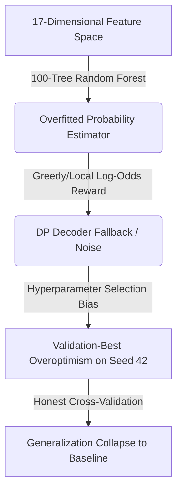
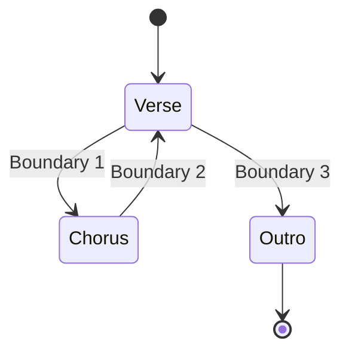

# Proposals for Next Steps: Resolving Phase 1 Generalization Collapse

This document outlines key technical proposals to recover generalization performance for **Phase 1 (Chroma/Onset SSM Prototype)**, escaping the F1@0.5s validation collapse while realizing the candidate-ceiling headroom.

---

## Technical Diagnostic: Why Did Phase 1e Overfit?

Our nested-split validation-best lift (+3.30% F1@0.5s, $p=0.0194$) completely collapsed under 5-fold cross-validation (F1@0.5s: 7.11% vs. 7.08% baseline, $p=0.720$).

1. **High Model Capacity vs. Small Data**: A 100-tree Random Forest classifier has high capacity and easily memorizes local correlations in the training tracks ($N \approx 180$).
2. **Feature Collinearity & Noise**: 17 features (multiple chroma difference timescales, onset densities, novelty contrast) led to high collinearity, confusing the tree splits on unseen folds.
3. **Local Reward Calibration**: The DP decoder relies on the log-odds of the classifier's output. Tree-based probabilities are often poorly calibrated (especially at the extremes), causing the segment solver to fall back to baseline boundaries or over-segment.

---

## Proposed Architectural Solutions

### Proposal 1: Regularized Linear Selector (L1 Logistic Regression)
Instead of high-capacity ensembles like Random Forests, use a simpler linear classifier with a strong regularization penalty.

* **Method**: Train a Logistic Regression model with an $L_1$ penalty (Lasso).
* **Why it works**:
  * **Feature Selection**: The $L_1$ penalty forces coefficients of noisy, redundant features to exactly zero, selecting only the most robust indicators of boundaries.
  * **Calibration**: Logistic regression outputs naturally smooth, well-calibrated probabilities, providing a more reliable log-odds reward signal for the DP solver.
  * **Lower Variance**: Simpler models have lower variance, making them less prone to overfitting on small datasets.

---

### Proposal 2: Feature Pruning and Dimensionality Reduction
Reduce the feature representation from 17 dimensions to a core subset of 4-5 high-leverage features.

* **Core Features Proposed**:
  1. `dist_to_refined` / `dist_to_baseline`: Anchoring distance to baseline boundaries (enforcing the structural skeleton).
  2. `ssm_novelty_prominence`: Local checkerboard correlation peak height.
  3. `onset_strength_max`: Maximum onset strength within a 0.5s snapping window.
  4. `chroma_diff_10s`: Long-term harmonic change to capture major section transitions.

---

### Proposal 3: State-Based Sequence Decoder (HMM / Segment-State Model)
The current DP decoder segments audio purely based on segment duration priors and local boundary rewards, ignoring section identity.

* **Method**: Implement a Hidden Markov Model (HMM) or Segment-State Model where states represent repeating structural units (e.g., Chorus, Verse, Bridge).
* **Why it works**:
  * Enforces **global consistency** (e.g., if section $A$ is 30 seconds long, the next occurrence of section $A$ should have similar chroma profile and duration).
  * Prevents over-segmentation caused by short local onset bursts.

---

### Proposal 4: Multi-Scale SSM Checkerboard Kernels
A single SSM resolution struggles to capture both fine-grained changes (e.g., 0.5s boundary snaps) and macro-structural shifts (e.g., 15s transitions).

* **Method**: Precompute SSMs at multiple scales (e.g., 0.2s, 1.0s, and 3.0s downsampling) and apply corresponding checkerboard kernels.
* **Feature Integration**: Feed the multi-scale novelty curves directly into the selection model.

---

## Updated Protocol Constraints for Next Phase

To prevent another false-positive cycle, we propose the following changes to our validation harness:

> [!IMPORTANT]
> **1. CV-First Testing**: Any new model variant must be evaluated using the 5-fold cross-validation script (`evaluate_salami_phase1e_cv.py`) *before* claims of improvement are made.
>
> **2. Strictly Decoupled HPO**: Hyperparameter optimization must run entirely inside each cross-validation training fold (nested cross-validation) to prevent parameter leakage.
>
> **3. Keep the Holdout Frozen**: The 57 holdout tracks (`holdout_tracks.json`) must remain completely untouched until we have a statistically significant, cross-validated lift.
