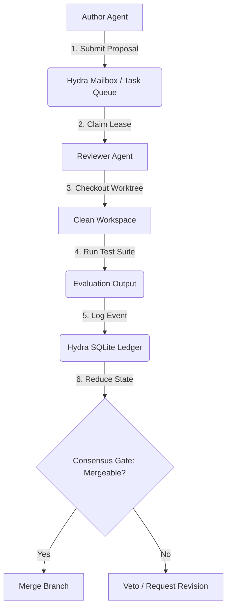
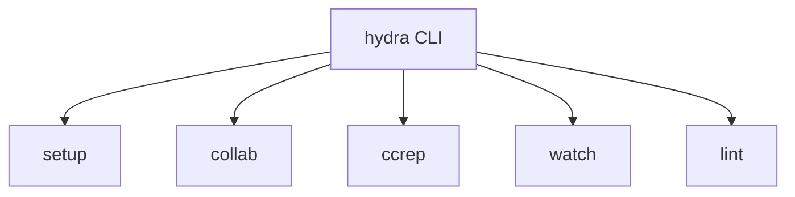

# Hydra: Git & File-Based Multi-Agent Collaboration Protocol
## Design Document

Hydra is a lightweight, asynchronous, file-system-based orchestration protocol designed to coordinate multi-agent and human-agent teams within a shared repository worktree. It enforces strict validation and consensus gates (the "Quality Ratchet") using standard software engineering structures (Git, code reviews, test suites, and clean-workspace evaluations).

---

## Core Principles

1. **UNIX Philosophy**: No heavy orchestrators or message brokers. Everything is backed by directories, JSON envelopes, and local SQLite databases.
2. **Asynchronous Handoffs**: Agents and humans are treated as background workers communicating via mailboxes and task queues, preventing blocking wait-loops.
3. **Review/Author Decoupling**: Veto-power resides with independent verifying agents running in clean Git worktrees, preventing data-leakage and false-positive merges.
4. **Append-Only Ledger**: All consensus events (proposals, evaluations, critiques, merges) are recorded in an immutable event log, and materialized views are derived deterministically by a state-reduction fold.

---

## Directory & Storage Redesign

We replace the repository-specific `scratch/` folder with a standardized hidden directory at the root of the project: `.hydra/`.

```
<Project Root>/
├── .hydra/                   # Hidden coordination directory
│   ├── ledger.db             # SQLite consensus database
│   ├── mailbox/              # Asynchronous message exchange
│   │   ├── tmp/              # Atomic write staging
│   │   ├── <actor_a>/        # Actor A inbox
│   │   │   ├── new/          # Unread/pending messages
│   │   │   └── cur/          # Processed/archive messages
│   │   └── <actor_b>/        # Actor B inbox
│   └── tasks/                # Atomic task dispatcher
│       ├── open/             # Available tasks waiting to be claimed
│       ├── claimed/          # Active tasks leased by workers
│       │   └── <actor>/      # Subdirectory named after lease owner
│       └── done/             # Completed tasks (+ final outputs)
```

### Path Resolution
* **Default Directory**: `.hydra/` located at the primary Git worktree root (resolved via `git rev-parse --show-toplevel`).
* **Fallback Directory**: `/tmp/hydra/` for short-lived, transient, or test configurations.
* **Override**: Settable via environment variables (`HYDRA_DIR`) or explicit command-line flags.

---

## Technical Architecture



### 1. The Mailbox (Asynchronous Messaging)
Mailbox exchange follows a simplified Maildir structure. Atomicity is guaranteed by using `os.replace` / `os.rename` operations:
1. Write JSON message to `.hydra/mailbox/tmp/` (under a unique UUID name).
2. Atomically rename to `.hydra/mailbox/<recipient>/new/` (prefixed with a nanosecond timestamp for lexicographical sorting).

### 2. The Task Queue (Lease-Based Claiming)
To prevent two agents from running the same job:
1. Tasks are posted as JSON files under `.hydra/tasks/open/`.
2. An agent claims a task by atomically renaming the file to `.hydra/tasks/claimed/<actor>/<task_id>.json`.
3. If the rename fails (because another agent won the race), the agent catches the error and retries the next task.
4. Tasks have a Lease TTL. A background sweeper releases expired leases back to `open/` if an agent crashes.

### 3. The Ledger (Event Sourcing & Consensus)
A single SQLite database (`.hydra/ledger.db`) stores the append-only event log. Derived state (proposals, critiques, merges) is generated deterministically by reducing the log.

#### Event Vocabulary
* `task_claimed`: A lease is acquired by an actor.
* `proposal_submitted`: Code changes/design proposed (references git commit SHA).
* `evaluation_completed`: Test suite outcomes (references test results JSON).
* `critique_submitted`: Qualitative review (STANCE: `approve`, `veto`, `comment`).
* `merge_recorded`: Consensus reached, change merged.

---

## Making Hydra Generic

To packaging the framework as a standalone Python library `hydra-core`, we decouple it from specific directories and actor identities:

| Hardcoded Context | Generic Resolution |
|---|---|
| **Directory (`tools/`)** | Submodule package using `pyproject.toml` console scripts. Commands like `hydra-mbox` and `hydra-ledger` are installed system-wide in the Python environment path. |
| **Storage (`scratch/`)** | Standardized to `.hydra/` at the git root, `/tmp/hydra/` for tests, or custom paths via `HYDRA_DIR` / `--dir`. |
| **Actor Identity (`roberto`)** | Passed as runtime arguments (e.g. `--actor`, `--recipient`) or inferred via configuration files (`.hydra/config.json`). |
| **Linter Paths** | The session verification linter takes a path argument (`--session-dir`) rather than scanning `doc/collab/sessions/` by default. |

---

## Unified Command Line Interface (CLI)

To simplify developer operations and agent interactions, Hydra exposes a single unified CLI command `hydra` with five core subcommands.



### 1. `hydra setup --agents <names>`
Initializes a fresh repository or worktree for Hydra coordination.
* **Actions**:
  * Creates the hidden `.hydra/` directory at the git top-level.
  * Generates `.hydra/config.json` containing active agent names (e.g. `claude, agy, codex`) and default parameters.
  * Initializes the SQLite ledger `.hydra/ledger.db`.
  * Creates inbox mailboxes (`new/` and `cur/`) for each listed agent plus `human`.
* **Example**:
  ```bash
  hydra setup --agents claude,agy,codex
  ```

### 2. `hydra collab <subcommand>`
The primary communication interface used by agents and wrappers to manage task-claiming and messaging.
* **Subcommands**:
  * `send --to <recipient> --type <kind> --payload <json>`: Send an atomic JSON message.
  * `recv [--type <kind>] [--timeout <sec>]`: Wait for and retrieve messages.
  * `claim [--ttl <sec>]`: Atomic race-to-lease to claim the next open task.
  * `complete --task-id <id> --result <json>`: Report task completion and output.

### 3. `hydra ccrep <subcommand>`
The protocol interface for the **CCREP Quality Ratchet**. Tracks code reviews and proposals.
* **Subcommands**:
  * `propose --task <id> --commit <sha>`: Submit a new branch proposal.
  * `evaluate --proposal <id> --status <pass|fail> --report <json>`: Log automated test validation metrics.
  * `critique --proposal <id> --stance <approve|veto|comment> --message <text>`: Submit qualitative reviewer consensus.
  * `merge --proposal <id>`: Record a finalized merge event.
  * `status [<task_id>]`: Query the derived consensus state.

### 4. `hydra watch`
A real-time logging and dashboard command designed for humans (and agents in watch mode) to monitor coordination.
* **Behavior**:
  * Uses `watchfiles` or WAL database polling to stream live actions.
  * Acts like a multiplexed `tail -f` for the entire coordination layer.
  * Prints a formatted stream of incoming inbox messages and consensus state transitions (e.g. `[14:38:00] agy -> claude: Task Completed`, `[14:38:05] claude approved proposal p3 (Consensus: MERGEABLE)`).

### 5. `hydra lint [--dir <path>]`
Verifies that all collab logs and session markdown files follow the pre-registered protocol syntax and frontmatter rules.

---

## Standalone Package Setup (`pyproject.toml`)

```toml
[project]
name = "hydra-core"
version = "0.1.0"
description = "A git-integrated multi-agent collaboration and consensus framework"
requires-python = ">=3.10"
dependencies = [
    "click>=8.0.0",
    "watchfiles>=0.21.0",
]

[project.scripts]
hydra = "hydra.cli:main"
```

