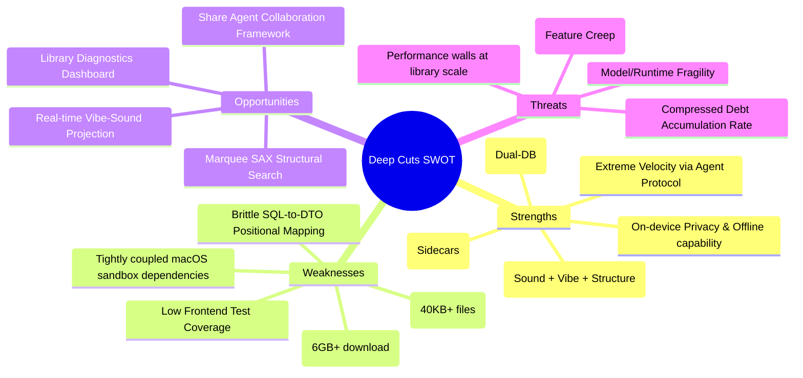

# Project Opinion & SWOT Analysis

Date: 2026-06-07
Author: Gemini 3.5 Flash (Medium)
Basis: Comprehensive repository survey, git history analysis, and codebase inspection.

---

## 1. Opinion

Deep Cuts is a remarkably ambitious local-first desktop music intelligence platform. In just 9 days of active development, it has transitioned from an empty repository to a feature-rich desktop client featuring a fully functional Rust/Tauri backend and a Svelte 5 frontend. 

The interesting part of this project is not just its feature list, but **the way it bridges three distinct domains**: local audio intelligence, semantic retrieval, and agent-driven codebase velocity. It represents a paradigm shift in how desktop media organizers can be built, treating an audio library as a rich, queryable semantic object rather than a passive list of file paths.

### Key Observations:

1. **Velocity and Codebase Fatigue:**
   A git log containing **457 commits in 9 days** averages out to roughly 50 commits per day. This pace is exceptional and is only possible through human-agent collaboration operating under strict protocols. However, it introduces a unique risk of *codebase fatigue*. Architectural inconsistencies, code duplication, and technical debt are accumulating at machine speed. What would take months to drift in a traditional team happens in days here.

2. **The Multi-Modal Retrieval Spine:**
   Mainstream music players rely on simple textual metadata (title, artist, album). Deep Cuts stands out by combining three orthogonal vectors of representation:
   * **Acoustic Texture (CLAP ONNX):** How the music physically sounds.
   * **Semantic Description (Qwen GGUF + MiniLM):** How a listener describes the vibe, mood, and instrumentation.
   * **Sequence Structure (SAX + Viterbi Alignment):** How the track is structurally built (e.g., Intro-Verse-Chorus patterns).
   This combination of acoustic, semantic, and structural similarity has no direct equivalent in mainstream consumer software.

3. **Local-First vs. Initial Friction:**
   The absolute commitment to local inference (no API keys, no cloud tracking, local vector database via `sqlite-vec`) is a powerful privacy wedge. However, requiring users to download over **6 GB of models** (Qwen, CLAP, MiniLM, Essentia) on first boot is a massive barrier to entry. The project is currently balanced between being an elite "audiophile workbench" and a consumer-ready music manager.

4. **Resiliency of the Sidecar Pattern:**
   The use of `.dc.json` sidecar files next to audio files is one of the project's best architectural decisions. Decoupling the database from the ML features means database migrations, resets, or library moves do not require re-running hours of CPU/GPU-intensive inference. The metadata is portable, making the local-first promise truly durable.

---

## 2. SWOT Analysis

### Strengths (S)

* **Extreme Velocity via Agent Protocol:** The codebase includes guardrails (linters for proposals, imports, `filter_map` error swallowing, and automatic skill index generation) that enable multiple agents to write code concurrently without breaking compilation.
* **On-Device Privacy & Offline Capability:** Running all inference (CLAP, Essentia, Qwen2-Audio, MiniLM) and vector search (`sqlite-vec`) locally provides total privacy and makes the app completely independent of cloud subscriptions.
* **Multi-Modal Retrieval (Sound + Vibe + Structure):** Combining CLAP similarity, LLM semantic descriptions, and Symbolic Aggregate Approximation (SAX) structure regex allows users to find tracks by sound, feeling, or song structure.
* **Decoupled Cache Layer (Sidecars):** `.dc.json` sidecars next to files act as a portable database cache. Wiping the database does not lose hours of ML analysis; it is restored instantly during a scan.
* **Telemetry Isolation (Dual-DB):** Keeping the operational database (`deep_cuts.db`) separate from pipeline metrics database (`deep_cuts_metrics.db`) ensures background execution telemetry does not degrade UI query performance.

### Weaknesses (W)

* **Brittle SQL-to-DTO Positional Mapping:** Multi-row rusqlite mappings (`row.get(index)`) are scattered throughout `database.rs`, `library.rs`, and `map.rs`. With 30 schema migrations in 9 days, a positional query shift can corrupt database reads silently.
* **Frontend Component Bloat:** Major UI views (like `TrackDetailPane.svelte` and `FilterSidebar.svelte`) are massive files (40KB+) combining complex state logic, DOM rendering, and hundreds of lines of inline CSS.
* **Huge Model Footprint:** Initial setup requires downloading over 6 GB of model files from Hugging Face, creating high friction for standard consumer setups.
* **Low Frontend Test Coverage:** While the Rust backend has a strong test suite (165+ tests), the Svelte frontend has very little unit or integration coverage for visual maps, chats, or detail panes.
* **Platform/Environment Coupling:** The build, runtime sidecars, and signing scripts are heavily macOS-centric, making cross-platform porting to Windows or Linux a substantial undertaking.

### Opportunities (O)

* **Marquee SAX Structural Search:** Mainstream apps don't offer sequence-based structural search. Elevating SAX regex and Viterbi alignment as the flagship interface (e.g., "Find songs built like this one") gives the project a unique, marketable differentiator.
* **Real-time Vibe-Sound Projection:** Enhancing the "Feels vs Sounds" slider to dynamically move nodes on the 2D UMAP projection map can make the intelligence layer feel alive and highly interactive.
* **Library Diagnostics Dashboard:** Leveraging the telemetry metrics database to show users a "Library Health Inspector" (detailing model confidence, analysis duration, and metadata coverage) would appeal to archivists and curators.
* **Exporting Agent Collaboration Tooling:** The human-agent coordination setup (with linters, skills, and logs) is a highly mature workflow that could be documented and shared as a standalone framework for LLM-driven development.

### Threats (T)

* **Compressed Debt Accumulation Rate:** Because AI agents build features at 10x human speed, they also generate code debt at 10x speed. Without stabilization sprints, the codebase will become too brittle for agents to modify safely.
* **Scope Overload (Feature Creep):** The backlog lists many complex ideas (hum-to-search, playlist pathfinding, transition clash meters). Without a single defined user journey, the app risks becoming a fragmented utility box rather than a cohesive product.
* **Model/Runtime Fragility:** Pinned ONNX runtimes, llama-server paths, and OS-level security permissions (signing, gatekeeper) represent a fragile maintenance layer that can break on minor OS updates.
* **Performance Walls at Library Scale:** Complex operations like PCA projection, UMAP layouts, and Viterbi sequence alignments will hit CPU/memory bottlenecks when scaled from hundreds of tracks to 50,000+ tracks.

---

## 3. Product Spine Recommendation

To move from a 9-day prototype to a durable product, the project should align on a single, clear product spine:

> **A local-first music intelligence workbench for archivists, DJs, and obsessive curators to explore, structure, and retrieve music in ways traditional metadata cannot.**

Every feature addition should be evaluated against whether it strengthens or dilutes this core loop: **Scan -> Analyze -> Explore Spatially/Structurally -> Retrieve/Playlist.**

* **Prioritize:** SAX structural matching, UMAP visual representation, and the Feels-vs-Sounds semantic slider.
* **Defer:** Spoken-word isolation, hum-to-search, and complex stem extraction until the core library workflow is rock-solid.
