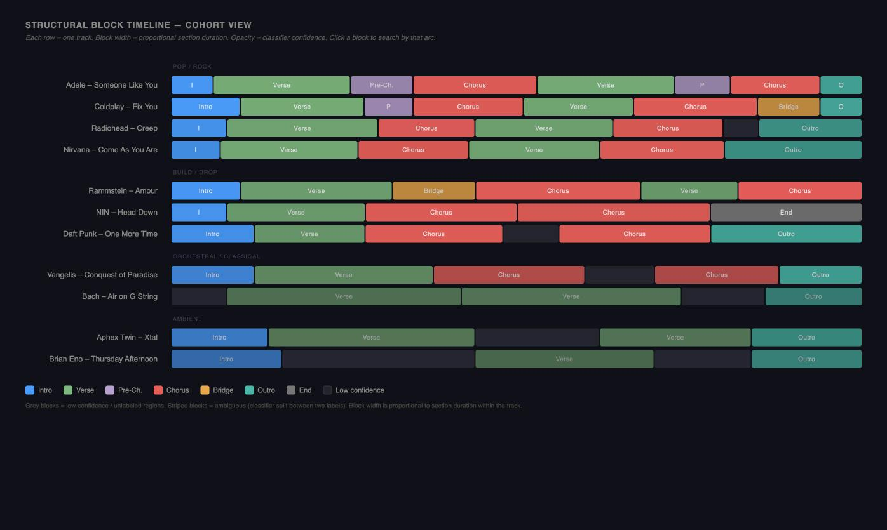

# Track Comparison UI: Design & Brainstorming

This document explores the design tradeoffs and UI/UX paradigms for comparing tracks based on their structural labels (Intro, Verse, Chorus, Outro) and timbral embeddings (CLAP).

---

## Current State

This is still primarily a design brainstorm. The structural analysis substrate exists, but a dedicated track-comparison workflow has not been found in the app.

| Area | Status | Evidence / Notes |
| :--- | :--- | :--- |
| Structural analysis data | Partially implemented | SAX strings, alignment data, and structure clusters are available in the backend and surfaced in several existing views. |
| Structural block timeline | Need human review | The mockup in `track-comparison-mockup.png` documents the intended direction, but no dedicated comparison page/panel was found. |
| Deep-focus comparison deck | Need human review | Synchronized playback, crossfader, and section connector UI remain proposal material. |
| Cohort comparison workflow | Need human review | Existing track lists and structure filters provide adjacent building blocks, but the comparison dock/grid workflow is not implemented. |

---

## The Core Dilemma: Deep Focus vs. Cohort Analysis

How we design the track comparison UI depends heavily on the scale of tracks being compared:

| Dimension | Deep Focus (2–3 Tracks) | Cohort Analysis (10+ Tracks) |
| :--- | :--- | :--- |
| **Primary Goal** | Transition planning, micro-alignment, exact section matching. | Pattern recognition, playlist auditing, structural grouping. |
| **Data Density** | Very high detail per track (waveforms, exact timbres, playback controls). | High abstraction (parallel line segments, heatmaps, matrices). |
| **Interactive Playback** | Crucial (crossfading, synchronized playheads, cue points). | Minimal or sequential (single-track preview on hover/click). |
| **Target User** | DJs, curators curating a specific transition, analysts. | Collectors organizing library genres, playlist builders. |

---

## Approach A: Deep Focus (2–3 Tracks)
*“How do these specific songs fit together?”*

In this view, the UI is optimized for a small slot count (ideally 2 stacked tracks, expandable to 3). 

### UI Components
1. **Stacked Structural Lanes**:
   * Timelines representing each track, divided into color-coded blocks for each high-confidence structural section (`Intro`, `Verse`, `Chorus`, etc.).
   * The playheads for all compared tracks are aligned to the same relative percentage (0% to 100%) or absolute time scale.
2. **D3.js Cross-Similarity Connectors**:
   * Interactive curves connecting sections of Track A to sections of Track B.
   * **Visual weight (thickness/opacity)** corresponds to CLAP cosine similarity.
   * Highlighted lines show mix-points (e.g., Track A's Outro links strongly to Track B's Intro).
3. **Interactive Sync Deck**:
   * A mini-crossfader to transition audio between the tracks.
   * A "Sync Playheads" button to scrub through both timelines simultaneously, allowing the user to hear how the waveforms sound at corresponding structural points.

---

## Approach B: Cohort Analysis (10+ Tracks)

### B0 — Structural Block Timeline (preferred primary view)

Each track is a single row of proportionally-sized labeled blocks representing its section
sequence in order:

```
Adele – Someone Like You  [Intro ][  Verse  ][    Chorus    ][  Verse  ][Outro]
Radiohead – Creep         [Intro][  Verse  ][Chorus][  Verse  ][Chorus  ][Outro]
NIN – Head Down           [Intro][  Verse  ][   Chorus   ][Chorus][End ]
Bach – Air on G String    [          Verse          ][       Verse       ][Outro]
```

**Design decisions:**
- **Block width** is proportional to section duration as a fraction of track length. Short
  intros may be narrow but are still visible; use a minimum rendered width of ~12px with a
  tooltip showing actual duration.
- **Color** encodes section type (same palette as heatmap). **Opacity** encodes MLP
  confidence — low-confidence sections fade, giving visual weight to certain regions.
- **Unlabeled / low-confidence regions** render as a plain dark grey block, not blank space,
  so the full track length is always represented.
- **Ambiguous segments** (classifier split between two labels, e.g. Verse/Bridge) render as
  a split-color block or show the dominant label with reduced opacity.
- **Repeated sections** render as separate blocks in sequence (`[V][C][V][C]`) to preserve
  arc information. A compact repeat marker (`×2`) is a future option.

**Interaction:**
- Clicking a block in any row sets that section as the search origin and runs the two-stage
  arc search (stage 1: same structural archetype; stage 2: DTW reranking). This is the
  primary entry point for click-to-query.
- Hovering a block shows a tooltip: section label, duration, confidence %, and the
  10-second CLAP window that was sampled from it.
- Clicking a track row while holding a modifier key adds it to the Comparison Dock.

**Why this beats time-indexed parallel coordinates:** blocks are duration-agnostic and
sequence-preserving. A 3-min pop track and a 10-min ambient piece are directly comparable
because both are normalised to the same row width.

**Relationship to the heatmap (B2):** the block timeline is the default cohort view. The
heatmap is an optional secondary view ("show as grid") useful for filtering by section
presence across a large set. They are complementary, not competing.




*“What is the structural distribution of this playlist?”*

In this view, we display a whole collection or playlist (e.g., 20–50 tracks) to help the user spot patterns or sort them.

### UI Components
1. **Parallel Coordinates Chart**:
   * Every track is represented by a single multi-segment line weaving through 16 steps (representing the 16 time segments of our SAX analysis).
   * The Y-axis represents energy or repetition score.
   * A dense web of lines reveals the "main highway" of structural patterns (e.g. 80% of the playlist follows a certain shape, while 2 outliers drop immediately).
2. **Structural Heatmap / Matrix Grid**:
   * A grid where each row is a track and each column is a **section type** (Intro, Verse, Pre-Ch., Chorus, Bridge, Outro, End) — not a raw time step.
   * Colored cells indicate the section type; opacity encodes MLP classifier confidence. Blank cells mean the section was not detected in that track.
   * Sorting the grid by "Structural Similarity" groups identical archetypes together, making it easy to see the blocks of Pop, Electronic, or Ambient songs.
   * **Why label-indexed beats time-indexed**: a raw 16-step grid forces a 3-min pop track and a 10-min ambient piece into the same columns — segment 8 means 1:30 in one case and 5:00 in the other, making cross-track comparison meaningless. Section-type columns are duration-agnostic.
   * Columns with < 20% fill rate (e.g. Pre-Chorus in an ambient-heavy playlist) can be collapsed by default with a "show all sections" toggle.

   *(See `tools/mockup_heatmap.html` for an interactive version of this view.)*
3. **Cluster Mapping**:
   * Projects the 16-segment label/probability sequences into 2D space (using UMAP/t-SNE) so songs with identical structural arcs group into physical islands.

---

## The Proposed Hybrid: "Focus & Cohort"

Instead of choosing one or the other, we can implement a **docking workflow**:

1. **The Cohort List (Primary View)**:
   * The user views their playlist or search results.
   * A simplified, compact representation of structure (like the color-coded SAX bar in the track list) is shown for every track.
2. **The Comparison Dock**:
   * At the bottom of the screen, there is a collapsed **"Comparison Dock"** with 2 or 3 blank slots.
   * The user drags a track from the cohort list and drops it into a slot.
3. **The Deep Focus Overlay (Deck View)**:
   * Dropping tracks into the dock expands a detailed panel overlay showing the **Deep Focus** visual connectors, synchronized playheads, and crossfader.
   * This lets the user use the cohort view to *find* candidates, and the focus deck to *verify* and align the transition.
