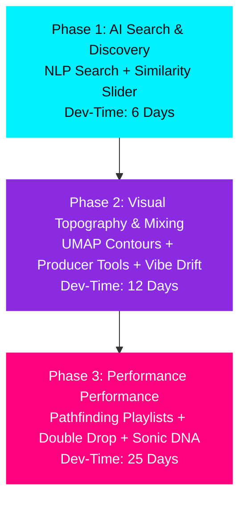

# Centralized Index: Advanced Feature Evaluations

Welcome to the central feature planning index. Deep Cuts is equipped with a robust local multi-modal database (acoustic CLAP embeddings, Qwen2-Audio prose descriptions, MiniLM text embeddings, and structured tags). This document centralizes the technical evaluation, resource sizing, and prioritization of 7 advanced feature areas that leverage this data, linking to the standalone technical breakdowns.

---

## 📊 Centralized Score Matrix

Below is a comparison of all evaluated features, ranked in order of **Priority Score**:

| Feature Area | Standalone Evaluation Doc | Effort | Uncertainty | Perf. Impact | Wow Factor | Priority | Sizing (Dev-Days) |
| :--- | :--- | :---: | :---: | :---: | :---: | :---: | :---: |
| ~~**1. Local NLP Semantic Search**~~ | ~~implemented~~ | | | | | | |
| **2. Blended "Sounds vs. Feels" Slider** | [sounds_feels_similarity_slider.md](feature-evaluations/sounds_feels_similarity_slider.md) | 3 / 10 | 2 / 10 | 1 / 10 | 9 / 10 | **9.0 / 10** | 3.5 Days |
| **3. Music Producer & Sampling Suite** | [producer_sampling_features.md](feature-evaluations/producer_sampling_features.md) | 6 / 10 | 3 / 10 | 2 / 10 | 9 / 10 | **8.5 / 10** | 6.0 Days |
| **4. UMAP Density Contours & Map Layering** | [umap_density_contours_map_layering.md](feature-evaluations/umap_density_contours_map_layering.md) | 4 / 10 | 3 / 10 | 3 / 10 | 9 / 10 | **8.0 / 10** | 4.5 Days |
| **5. DJ & Live Performance Suite** | [dj_performance_features.md](feature-evaluations/dj_performance_features.md) | 7 / 10 | 4 / 10 | 2 / 10 | 8 / 10 | **7.5 / 10** | 7.0 Days |
| **6. Pathfinding Playlists (Transitions)** | [pathfinding_playlists_transitions.md](feature-evaluations/pathfinding_playlists_transitions.md) | 5 / 10 | 4 / 10 | 1 / 10 | 8 / 10 | **7.0 / 10** | 5.0 Days |
| **7. Sonic DNA & Multimodal QA** | [sonic_dna_multimodal_qa.md](feature-evaluations/sonic_dna_multimodal_qa.md) | 9 / 10 | 8 / 10 | 8 / 10 | 10 / 10 | **5.5 / 10** | 18.0 Days |

---

## 📂 Standalone Feature Breakdowns

### ~~1. 🔍 Local NLP Semantic Search~~ ✅ Implemented

### 1. 🎚️ [Blended "Sounds vs. Feels" Slider](feature-evaluations/sounds_feels_similarity_slider.md)
* **Synopsis**: An interactive sidebar in the player panel providing real-time transitional suggestions. A visual slider lets the user blend acoustic similarity (CLAP 512-d) and conceptual similarity (MiniLM 384-d) scores using a linear interpolation formula.
* **Why it's a priority**: High visual impact, standard distance-merging math, and lightning-fast pre-computed vector lookups.

### 3. 🎛️ [Music Producer & Sampling Suite](feature-evaluations/producer_sampling_features.md)
* **Synopsis**: Provides dragging zones for external reference mixing (BPM/Key/LUFS checks), D3-based spectral overlays comparing Work-In-Progress vs. Reference mixes, UMAP-based "Crate Digger" obscurity indexing, clean instrumental scrapers, and automated tempo stretch/pitch transposing calculators.
* **Why it's a priority**: Highly practical tools for producers; the Obscurity Index and Pitch Transposer can be built in less than 2 days, while the D3 overlay provides a premium mix visualizer.

### 4. 🗺️ [UMAP Density Contours & Map Layering](feature-evaluations/umap_density_contours_map_layering.md)
* **Synopsis**: Overlays transparent, glowing neon topographic density lines on the 2D Music Map using D3-contour density grids. Integrates sidebar checkboxes to dim non-matching dots and highlight specific musical instruments.
* **Why it's a priority**: Extreme visual wow-factor that sets the app's styling apart, requiring optimized canvas redrawing routines.

### 5. 🌡️ [DJ & Live Performance Suite](feature-evaluations/dj_performance_features.md)
* **Synopsis**: Categorizes tracks into 5 Energy Levels using Qwen descriptor lists, highlights compatible Camelot Keys on UMAP, monitors playlist Vibe Drift alerting DJs to massive gaps, and implements a Double Drop Clash Meter analyzing 24-band spectral overlays.
* **Why it's a priority**: Highly professional mixing aids; the UMAP key highlighting and Vibe Drift indicators are very easy to build, while the double drop requires careful DSP frequency-correlation calculations.

### 6. 🔀 [Pathfinding Playlists (Transitions)](feature-evaluations/pathfinding_playlists_transitions.md)
* **Synopsis**: DJ playlist compiler that builds transitional paths on the map. The user clicks a Start Song and an End Song, and the Rust backend constructs a $k$-NN graph of 2D coordinates, runs an $A^*$ or Dijkstra shortest path search, and returns an acoustically smooth progression.
* **BPM/Key Edge Weights & Island-Bridging**: 
  - To prevent paths from jumping between vastly different tempos or discordant keys, the transition graph's edge weights are not solely based on 2D map distance.
  - **Dynamic Edge Weights**: Edge weight calculates as:
    `weight = distance_2d * (1.0 + bpm_penalty) * (1.0 + camelot_key_penalty)`
    Where the BPM penalty increases with tempo delta, and the key penalty increases based on harmonic distance on the Camelot wheel.
  - **Island-Bridging**: In UMAP projections, isolated sub-clusters ("islands") can create disconnected components, trapping the search. The pathfinder implements an **Island-Bridging heuristic**: it detects disconnected sub-graphs and dynamically creates sparse "bridges" (virtual edges with high transition penalties) connecting nearest-neighbor bridgehead nodes, guaranteeing a viable path from start to end without causing drastic musical jars.
* **Why it's a priority**: Unique playlisting utility with low backend performance footprint but requiring graph bridging heuristics for disconnected islands.

### 7. 🧬 [Sonic DNA & Multimodal QA](feature-evaluations/sonic_dna_multimodal_qa.md)
* **Synopsis**: A research-grade AI audio module featuring: continuous sliding-window CLAP analysis matching tracks via Rust Dynamic Time Warping (DTW), DSP frequency pre-filters (LPF/HPF/BPF), and an interactive Chat QA sidebar allowing users to conversationalize directly with selected WAV files using the local Qwen2-Audio server.
* **Why it's a priority**: Incredible, futuristic capability, but representing an $18$-day R&D hurdle with high risks of VRAM exhaustion, llama-server multimodal overflows, and 50x database storage bloat.

---

## 🛠️ Local Model Pool & Lifecycle Manager
To run multiple heavy machine learning models (CREPE, CLAP, MiniLM, and Qwen2-Audio ONNX sessions) inside a local desktop app without overwhelming system memory (RAM/VRAM) or crashing on lower-spec hardware, Deep Cuts uses a custom **Local Model Pool / Lifecycle Manager** in Rust/Tauri:
- **Thread-Safe Lazy Loading**: Model sessions are wrapped in thread-safe, lazily initialized `Arc<Mutex<Option<Session>>>` pools. Sessions are only loaded into memory when a feature requiring them is actively triggered.
- **Resource Lock Guarding**: An orchestrator ensures that Qwen2-Audio and heavy embedding pipelines cannot run concurrently. If a Qwen session is requested while a background CLAP embedding task is active, the manager pauses the embedding pipeline and locks the execution resources.
- **2-Minute Idle Eviction**: The Lifecycle Manager monitors a timer for each active model. When a model session remains idle with no incoming requests for more than **2 minutes**, the manager automatically evicts the session from RAM/VRAM, freeing up resources for system processes or Svelte frontend rendering.

---

## 📈 Strategic Phased Roadmap

To implement these features with maximum efficiency, we recommend a **Three-Phase Implementation Plan**:

1. **Phase 1: AI Search & Discovery (Immediate)**
   * Deliver **Local NLP Semantic Search** and the **Blended "Sounds vs. Feels" Similarity Slider**. 
   * *Benefit*: Requires only 6 days of dev-time, carries virtually zero risk, has zero performance impact, and immediately unlocks the full power of your existing model imports.
2. **Phase 2: Visual Topography & Production (Secondary)**
   * Deliver **UMAP Density Contours**, **Crate Digger sorting**, **Pitch/Tempo Harmonizer**, and **Playlist Vibe Drift Alerts**.
   * *Benefit*: Delivers major visual upgrades to the Music Map and highly useful tools for music production, with well-contained algorithms.
3. **Phase 3: Professional Performance & R&D (Long-Term)**
   * Deliver **Pathfinding Playlist routing**, **Double Drop Clash Metering**, and research **Sonic DNA / Multimodal Chat QA**.
   * *Benefit*: Introduces complex DSP algorithms and conversational AI memory spaces once the core experience is fully matured and stabilized.
